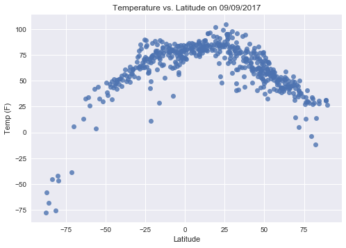
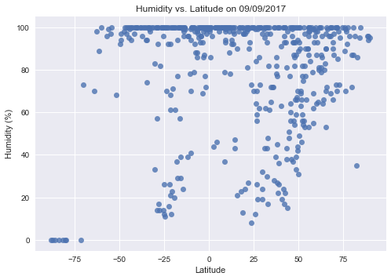
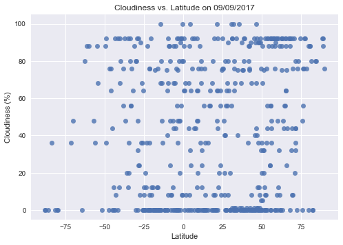
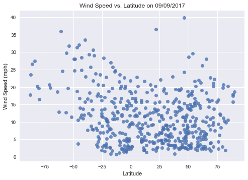

# WeatherPy

## Analysis

Three observations from the weather data plots of 500 randomly selected cities are:

1. The temperature is highest near latitude zero (the equator), and decreases away from latitude zero in both directions (North & South)

2. There is no regional correlation to % cloudiness or % humidity.

3. The majority of wind speed is less than 15 mph.


```python
# dependencies
import csv
import json
import requests
import random
import time
import matplotlib.pyplot as plt
import pandas as pd
import seaborn as sns
from citipy import citipy
```


```python
# create an empty dataframe and name the columns
rand_cities_df = pd.DataFrame(columns=["City",
                                       "Latitude",
                                       "Longitude",
                                       "Temp (F)",
                                       "Humidity (%)",
                                       "Cloudiness (%)",
                                       "Wind Speed (mph)"])
```


```python
#create a while loop to pull non-duplicate and random cities from citipy


# create a variable for number of cities to sample
sample_size = 500

# create a while loop to run until data frame is length of sample size
while len(rand_cities_df) < sample_size:
    
    # create a for loop that will run until sample number is reached
    for i in range(0, sample_size):
        
        # set random latitude/longitude 
        lat = round(random.uniform(-90.00, 90.00), 9)
        lng = round(random.uniform(-180.00, 180.00), 9)

        # pull nearest city from citipy using random latitude/longitude
        city = citipy.nearest_city(lat, lng)

        # if statement to prevent duplicate cities in data frame
        if city.city_name not in rand_cities_df.City.values:

            # append values for city, latitude and longitude to data frame
            rand_cities_df.set_value(i,"City", city.city_name)
            rand_cities_df.set_value(i, "Latitude", lat)
            rand_cities_df.set_value(i, "Longitude", lng)

        else:
            len(rand_cities_df) < sample_size 
```


```python
# create a for loop to pull weather data using OpenWeatherMapAPI

# set counter to be used in for loop
row_count = 1

# create a for loop that will run through the data frame
for index, row in rand_cities_df.iterrows():

    # open weather map API key
    api_key = "63e5cd6a894aa41d8d7c50ab4f0fc52f"

    # create endpoint URL
    target_url = "https://api.openweathermap.org/data/2.5/weather" \
    "?lat=%s&lon=%s&units=IMPERIAL&mode=json&APPID=%s" % (row["Latitude"], row["Longitude"], api_key)
    
    # print log to ensure loop is working correctly
    print("Now retrieving city # "+ str(row_count) + " | " + row["City"])
    print(target_url)
    row_count += 1
    
    # run requests to grab the JSON at the requested URL
    city_json = requests.get(target_url).json()
    
    
    # pull the temp, humidity, cloudiness and wind speed from the JSON
    # use try / except to skip any cities with errors
    try:
        temp = city_json["main"]["temp"]
        humidity = city_json["main"]["humidity"]
        cloud = city_json["clouds"]["all"]
        wind = city_json["wind"]["speed"]
        
        # append values for temp, humidity, cloudiness and wind speed to the data frame
        rand_cities_df.set_value(index, "Temp (F)", temp)
        rand_cities_df.set_value(index, "Humidity (%)", humidity)
        rand_cities_df.set_value(index, "Cloudiness (%)", cloud)
        rand_cities_df.set_value(index, "Wind Speed (mph)", wind)
        
    except:
        print("Error with city data. Skipping")
        continue
    
    # random wait time between API calls to prevent error
    time.sleep(random.randint(1, 4))

# save a csv of retrieved data    
rand_cities_df.to_csv("random_city_weather.csv")

# show top 50 rows of data frame
rand_cities_df.head(50)
```

    Now retrieving city # 1 | teguldet
    https://api.openweathermap.org/data/2.5/weather?lat=59.544582648&lon=89.441856683&units=IMPERIAL&mode=json&APPID=63e5cd6a894aa41d8d7c50ab4f0fc52f
    Now retrieving city # 2 | vila velha
    https://api.openweathermap.org/data/2.5/weather?lat=-28.701533512&lon=-22.003145577&units=IMPERIAL&mode=json&APPID=63e5cd6a894aa41d8d7c50ab4f0fc52f
    Now retrieving city # 3 | buguruslan
    https://api.openweathermap.org/data/2.5/weather?lat=53.615923835&lon=52.574512348&units=IMPERIAL&mode=json&APPID=63e5cd6a894aa41d8d7c50ab4f0fc52f
    Now retrieving city # 4 | sao gabriel da cachoeira
    https://api.openweathermap.org/data/2.5/weather?lat=0.019016995&lon=-67.77977746&units=IMPERIAL&mode=json&APPID=63e5cd6a894aa41d8d7c50ab4f0fc52f
    Now retrieving city # 5 | tonantins
    https://api.openweathermap.org/data/2.5/weather?lat=-2.392301495&lon=-68.413488981&units=IMPERIAL&mode=json&APPID=63e5cd6a894aa41d8d7c50ab4f0fc52f
    Now retrieving city # 6 | plettenberg bay
    https://api.openweathermap.org/data/2.5/weather?lat=-45.062341269&lon=23.301201244&units=IMPERIAL&mode=json&APPID=63e5cd6a894aa41d8d7c50ab4f0fc52f
    Now retrieving city # 7 | acajutla
    https://api.openweathermap.org/data/2.5/weather?lat=10.894724908&lon=-91.16105561&units=IMPERIAL&mode=json&APPID=63e5cd6a894aa41d8d7c50ab4f0fc52f
    Now retrieving city # 8 | manica
    https://api.openweathermap.org/data/2.5/weather?lat=-17.979987003&lon=33.159685516&units=IMPERIAL&mode=json&APPID=63e5cd6a894aa41d8d7c50ab4f0fc52f
    Now retrieving city # 9 | severnyy
    https://api.openweathermap.org/data/2.5/weather?lat=71.499989343&lon=66.050488225&units=IMPERIAL&mode=json&APPID=63e5cd6a894aa41d8d7c50ab4f0fc52f
    Now retrieving city # 10 | egvekinot
    https://api.openweathermap.org/data/2.5/weather?lat=59.698371417&lon=-178.29504269&units=IMPERIAL&mode=json&APPID=63e5cd6a894aa41d8d7c50ab4f0fc52f
    Now retrieving city # 11 | attawapiskat
    https://api.openweathermap.org/data/2.5/weather?lat=65.536298901&lon=-82.724054917&units=IMPERIAL&mode=json&APPID=63e5cd6a894aa41d8d7c50ab4f0fc52f
    Now retrieving city # 12 | anadyr
    https://api.openweathermap.org/data/2.5/weather?lat=63.359047219&lon=177.791705843&units=IMPERIAL&mode=json&APPID=63e5cd6a894aa41d8d7c50ab4f0fc52f
    Now retrieving city # 13 | kakrala
    https://api.openweathermap.org/data/2.5/weather?lat=27.78407005&lon=79.182998202&units=IMPERIAL&mode=json&APPID=63e5cd6a894aa41d8d7c50ab4f0fc52f
    Now retrieving city # 14 | atuona
    https://api.openweathermap.org/data/2.5/weather?lat=-1.231216975&lon=-141.795531112&units=IMPERIAL&mode=json&APPID=63e5cd6a894aa41d8d7c50ab4f0fc52f
    Now retrieving city # 15 | wufeng
    https://api.openweathermap.org/data/2.5/weather?lat=27.170098608&lon=104.568968139&units=IMPERIAL&mode=json&APPID=63e5cd6a894aa41d8d7c50ab4f0fc52f
    Now retrieving city # 16 | springbok
    https://api.openweathermap.org/data/2.5/weather?lat=-30.063064471&lon=18.043155948&units=IMPERIAL&mode=json&APPID=63e5cd6a894aa41d8d7c50ab4f0fc52f
    Now retrieving city # 17 | flinders
    https://api.openweathermap.org/data/2.5/weather?lat=-33.052101978&lon=129.561984326&units=IMPERIAL&mode=json&APPID=63e5cd6a894aa41d8d7c50ab4f0fc52f
    Now retrieving city # 18 | breaza
    https://api.openweathermap.org/data/2.5/weather?lat=47.649866737&lon=25.34606006&units=IMPERIAL&mode=json&APPID=63e5cd6a894aa41d8d7c50ab4f0fc52f
    Now retrieving city # 19 | chongoyape
    https://api.openweathermap.org/data/2.5/weather?lat=-6.702471159&lon=-79.560663197&units=IMPERIAL&mode=json&APPID=63e5cd6a894aa41d8d7c50ab4f0fc52f
    Now retrieving city # 20 | channel-port aux basques
    https://api.openweathermap.org/data/2.5/weather?lat=46.307175926&lon=-58.474706336&units=IMPERIAL&mode=json&APPID=63e5cd6a894aa41d8d7c50ab4f0fc52f
    Now retrieving city # 21 | pemba
    https://api.openweathermap.org/data/2.5/weather?lat=-13.637963348&lon=40.543660172&units=IMPERIAL&mode=json&APPID=63e5cd6a894aa41d8d7c50ab4f0fc52f
    Now retrieving city # 22 | narsaq
    https://api.openweathermap.org/data/2.5/weather?lat=82.153336351&lon=-66.040185805&units=IMPERIAL&mode=json&APPID=63e5cd6a894aa41d8d7c50ab4f0fc52f
    Now retrieving city # 23 | saint-philippe
    https://api.openweathermap.org/data/2.5/weather?lat=-49.074818879&lon=65.119525845&units=IMPERIAL&mode=json&APPID=63e5cd6a894aa41d8d7c50ab4f0fc52f
    Now retrieving city # 24 | uhlove
    https://api.openweathermap.org/data/2.5/weather?lat=43.844588577&lon=32.781631292&units=IMPERIAL&mode=json&APPID=63e5cd6a894aa41d8d7c50ab4f0fc52f
    Now retrieving city # 25 | khonuu
    https://api.openweathermap.org/data/2.5/weather?lat=68.9851993&lon=142.979531536&units=IMPERIAL&mode=json&APPID=63e5cd6a894aa41d8d7c50ab4f0fc52f
    Now retrieving city # 26 | kedrovyy
    https://api.openweathermap.org/data/2.5/weather?lat=58.187054962&lon=80.179214175&units=IMPERIAL&mode=json&APPID=63e5cd6a894aa41d8d7c50ab4f0fc52f
    Now retrieving city # 27 | kachikau
    https://api.openweathermap.org/data/2.5/weather?lat=-19.079713044&lon=24.748793563&units=IMPERIAL&mode=json&APPID=63e5cd6a894aa41d8d7c50ab4f0fc52f
    Now retrieving city # 28 | looc
    https://api.openweathermap.org/data/2.5/weather?lat=13.605785123&lon=120.297502524&units=IMPERIAL&mode=json&APPID=63e5cd6a894aa41d8d7c50ab4f0fc52f
    Now retrieving city # 29 | lompoc
    https://api.openweathermap.org/data/2.5/weather?lat=30.71584446&lon=-124.678062087&units=IMPERIAL&mode=json&APPID=63e5cd6a894aa41d8d7c50ab4f0fc52f
    Now retrieving city # 30 | victoria
    https://api.openweathermap.org/data/2.5/weather?lat=1.267264249&lon=54.70227994&units=IMPERIAL&mode=json&APPID=63e5cd6a894aa41d8d7c50ab4f0fc52f
    Now retrieving city # 31 | eshowe
    https://api.openweathermap.org/data/2.5/weather?lat=-28.950296137&lon=31.332123863&units=IMPERIAL&mode=json&APPID=63e5cd6a894aa41d8d7c50ab4f0fc52f
    Now retrieving city # 32 | dingle
    https://api.openweathermap.org/data/2.5/weather?lat=55.832873214&lon=-16.951591895&units=IMPERIAL&mode=json&APPID=63e5cd6a894aa41d8d7c50ab4f0fc52f
    Now retrieving city # 33 | nushki
    https://api.openweathermap.org/data/2.5/weather?lat=29.842300418&lon=65.524266173&units=IMPERIAL&mode=json&APPID=63e5cd6a894aa41d8d7c50ab4f0fc52f
    Now retrieving city # 34 | sao joao del rei
    https://api.openweathermap.org/data/2.5/weather?lat=-21.396862275&lon=-44.237721377&units=IMPERIAL&mode=json&APPID=63e5cd6a894aa41d8d7c50ab4f0fc52f
    Now retrieving city # 35 | corner brook
    https://api.openweathermap.org/data/2.5/weather?lat=49.275954897&lon=-57.820216229&units=IMPERIAL&mode=json&APPID=63e5cd6a894aa41d8d7c50ab4f0fc52f
    Now retrieving city # 36 | tamiahua
    https://api.openweathermap.org/data/2.5/weather?lat=21.719514568&lon=-97.184243341&units=IMPERIAL&mode=json&APPID=63e5cd6a894aa41d8d7c50ab4f0fc52f
    Now retrieving city # 37 | los llanos de aridane
    https://api.openweathermap.org/data/2.5/weather?lat=28.730455612&lon=-26.636248148&units=IMPERIAL&mode=json&APPID=63e5cd6a894aa41d8d7c50ab4f0fc52f
    Now retrieving city # 38 | faya
    https://api.openweathermap.org/data/2.5/weather?lat=18.957963223&lon=17.255585915&units=IMPERIAL&mode=json&APPID=63e5cd6a894aa41d8d7c50ab4f0fc52f
    Now retrieving city # 39 | severo-kurilsk
    https://api.openweathermap.org/data/2.5/weather?lat=31.172772566&lon=166.662459615&units=IMPERIAL&mode=json&APPID=63e5cd6a894aa41d8d7c50ab4f0fc52f
    Now retrieving city # 40 | maracaju
    https://api.openweathermap.org/data/2.5/weather?lat=-21.657456172&lon=-55.163552295&units=IMPERIAL&mode=json&APPID=63e5cd6a894aa41d8d7c50ab4f0fc52f
    Now retrieving city # 41 | san patricio
    https://api.openweathermap.org/data/2.5/weather?lat=8.839013843&lon=-115.116219662&units=IMPERIAL&mode=json&APPID=63e5cd6a894aa41d8d7c50ab4f0fc52f
    Now retrieving city # 42 | vila franca do campo
    https://api.openweathermap.org/data/2.5/weather?lat=38.335851478&lon=-23.80420432&units=IMPERIAL&mode=json&APPID=63e5cd6a894aa41d8d7c50ab4f0fc52f
    Now retrieving city # 43 | karratha
    https://api.openweathermap.org/data/2.5/weather?lat=-18.676565927&lon=115.057967501&units=IMPERIAL&mode=json&APPID=63e5cd6a894aa41d8d7c50ab4f0fc52f
    Now retrieving city # 44 | mount gambier
    https://api.openweathermap.org/data/2.5/weather?lat=-49.686370318&lon=130.159135562&units=IMPERIAL&mode=json&APPID=63e5cd6a894aa41d8d7c50ab4f0fc52f
    Now retrieving city # 45 | constitucion
    https://api.openweathermap.org/data/2.5/weather?lat=-32.123808301&lon=-79.705589694&units=IMPERIAL&mode=json&APPID=63e5cd6a894aa41d8d7c50ab4f0fc52f
    Now retrieving city # 46 | chilliwack
    https://api.openweathermap.org/data/2.5/weather?lat=48.886184837&lon=-122.041035677&units=IMPERIAL&mode=json&APPID=63e5cd6a894aa41d8d7c50ab4f0fc52f
    Now retrieving city # 47 | hofn
    https://api.openweathermap.org/data/2.5/weather?lat=70.470937442&lon=-10.132876159&units=IMPERIAL&mode=json&APPID=63e5cd6a894aa41d8d7c50ab4f0fc52f
    Now retrieving city # 48 | natal
    https://api.openweathermap.org/data/2.5/weather?lat=-2.729380787&lon=-25.127130205&units=IMPERIAL&mode=json&APPID=63e5cd6a894aa41d8d7c50ab4f0fc52f
    Now retrieving city # 49 | mar del plata
    https://api.openweathermap.org/data/2.5/weather?lat=-64.182269885&lon=-33.99538396&units=IMPERIAL&mode=json&APPID=63e5cd6a894aa41d8d7c50ab4f0fc52f
    Now retrieving city # 50 | verkhnyaya balkariya
    https://api.openweathermap.org/data/2.5/weather?lat=43.177411389&lon=43.532508535&units=IMPERIAL&mode=json&APPID=63e5cd6a894aa41d8d7c50ab4f0fc52f
    Now retrieving city # 51 | lasa
    https://api.openweathermap.org/data/2.5/weather?lat=32.194968457&lon=93.828365324&units=IMPERIAL&mode=json&APPID=63e5cd6a894aa41d8d7c50ab4f0fc52f
    Now retrieving city # 52 | krasnaya gorka
    https://api.openweathermap.org/data/2.5/weather?lat=55.364073642&lon=46.245542869&units=IMPERIAL&mode=json&APPID=63e5cd6a894aa41d8d7c50ab4f0fc52f
    Now retrieving city # 53 | matara
    https://api.openweathermap.org/data/2.5/weather?lat=0.408134743&lon=81.060420001&units=IMPERIAL&mode=json&APPID=63e5cd6a894aa41d8d7c50ab4f0fc52f
    Now retrieving city # 54 | luanda
    https://api.openweathermap.org/data/2.5/weather?lat=-9.268141244&lon=11.164673241&units=IMPERIAL&mode=json&APPID=63e5cd6a894aa41d8d7c50ab4f0fc52f
    Now retrieving city # 55 | joensuu
    https://api.openweathermap.org/data/2.5/weather?lat=62.540379479&lon=29.605736072&units=IMPERIAL&mode=json&APPID=63e5cd6a894aa41d8d7c50ab4f0fc52f
    Now retrieving city # 56 | micheweni
    https://api.openweathermap.org/data/2.5/weather?lat=-5.963582421&lon=45.330974377&units=IMPERIAL&mode=json&APPID=63e5cd6a894aa41d8d7c50ab4f0fc52f
    Now retrieving city # 57 | ust-tarka
    https://api.openweathermap.org/data/2.5/weather?lat=55.478965873&lon=75.450810652&units=IMPERIAL&mode=json&APPID=63e5cd6a894aa41d8d7c50ab4f0fc52f
    Now retrieving city # 58 | condado
    https://api.openweathermap.org/data/2.5/weather?lat=21.814438989&lon=-79.696357948&units=IMPERIAL&mode=json&APPID=63e5cd6a894aa41d8d7c50ab4f0fc52f
    Now retrieving city # 59 | moyobamba
    https://api.openweathermap.org/data/2.5/weather?lat=-5.842071234&lon=-77.031153813&units=IMPERIAL&mode=json&APPID=63e5cd6a894aa41d8d7c50ab4f0fc52f
    Now retrieving city # 60 | port elizabeth
    https://api.openweathermap.org/data/2.5/weather?lat=-70.186264531&lon=33.176597483&units=IMPERIAL&mode=json&APPID=63e5cd6a894aa41d8d7c50ab4f0fc52f
    Now retrieving city # 61 | colan
    https://api.openweathermap.org/data/2.5/weather?lat=-4.999689667&lon=-81.010047194&units=IMPERIAL&mode=json&APPID=63e5cd6a894aa41d8d7c50ab4f0fc52f
    Now retrieving city # 62 | desaguadero
    https://api.openweathermap.org/data/2.5/weather?lat=-16.538797242&lon=-68.722968546&units=IMPERIAL&mode=json&APPID=63e5cd6a894aa41d8d7c50ab4f0fc52f
    Now retrieving city # 63 | urdzhar
    https://api.openweathermap.org/data/2.5/weather?lat=48.465310714&lon=82.159257547&units=IMPERIAL&mode=json&APPID=63e5cd6a894aa41d8d7c50ab4f0fc52f
    Now retrieving city # 64 | rocha
    https://api.openweathermap.org/data/2.5/weather?lat=-46.001798829&lon=-43.420067866&units=IMPERIAL&mode=json&APPID=63e5cd6a894aa41d8d7c50ab4f0fc52f
    Now retrieving city # 65 | orange cove
    https://api.openweathermap.org/data/2.5/weather?lat=37.311875335&lon=-118.140044271&units=IMPERIAL&mode=json&APPID=63e5cd6a894aa41d8d7c50ab4f0fc52f
    Now retrieving city # 66 | ribeira grande
    https://api.openweathermap.org/data/2.5/weather?lat=31.295119558&lon=-45.077875181&units=IMPERIAL&mode=json&APPID=63e5cd6a894aa41d8d7c50ab4f0fc52f
    Now retrieving city # 67 | hoquiam
    https://api.openweathermap.org/data/2.5/weather?lat=46.903340738&lon=-125.500792748&units=IMPERIAL&mode=json&APPID=63e5cd6a894aa41d8d7c50ab4f0fc52f
    Now retrieving city # 68 | bontang
    https://api.openweathermap.org/data/2.5/weather?lat=1.627255973&lon=118.291566938&units=IMPERIAL&mode=json&APPID=63e5cd6a894aa41d8d7c50ab4f0fc52f
    Now retrieving city # 69 | luangwa
    https://api.openweathermap.org/data/2.5/weather?lat=-15.981609907&lon=30.97193373&units=IMPERIAL&mode=json&APPID=63e5cd6a894aa41d8d7c50ab4f0fc52f
    Now retrieving city # 70 | port macquarie
    https://api.openweathermap.org/data/2.5/weather?lat=-33.134879281&lon=160.17928555&units=IMPERIAL&mode=json&APPID=63e5cd6a894aa41d8d7c50ab4f0fc52f
    Now retrieving city # 71 | nago
    https://api.openweathermap.org/data/2.5/weather?lat=27.710437953&lon=127.035325193&units=IMPERIAL&mode=json&APPID=63e5cd6a894aa41d8d7c50ab4f0fc52f
    Now retrieving city # 72 | maragogi
    https://api.openweathermap.org/data/2.5/weather?lat=-16.291867382&lon=-26.362884123&units=IMPERIAL&mode=json&APPID=63e5cd6a894aa41d8d7c50ab4f0fc52f
    Now retrieving city # 73 | oschatz
    https://api.openweathermap.org/data/2.5/weather?lat=51.356957058&lon=12.968375596&units=IMPERIAL&mode=json&APPID=63e5cd6a894aa41d8d7c50ab4f0fc52f
    Now retrieving city # 74 | burayevo
    https://api.openweathermap.org/data/2.5/weather?lat=56.177280085&lon=55.488706457&units=IMPERIAL&mode=json&APPID=63e5cd6a894aa41d8d7c50ab4f0fc52f
    Now retrieving city # 75 | kathu
    https://api.openweathermap.org/data/2.5/weather?lat=-27.978697745&lon=22.618805405&units=IMPERIAL&mode=json&APPID=63e5cd6a894aa41d8d7c50ab4f0fc52f
    Now retrieving city # 76 | tres arroyos
    https://api.openweathermap.org/data/2.5/weather?lat=-40.729130128&lon=-60.485282926&units=IMPERIAL&mode=json&APPID=63e5cd6a894aa41d8d7c50ab4f0fc52f
    Now retrieving city # 77 | rio gallegos
    https://api.openweathermap.org/data/2.5/weather?lat=-51.89632727&lon=-68.877151487&units=IMPERIAL&mode=json&APPID=63e5cd6a894aa41d8d7c50ab4f0fc52f
    Now retrieving city # 78 | khlevnoye
    https://api.openweathermap.org/data/2.5/weather?lat=52.025725383&lon=39.045608651&units=IMPERIAL&mode=json&APPID=63e5cd6a894aa41d8d7c50ab4f0fc52f
    Now retrieving city # 79 | champerico
    https://api.openweathermap.org/data/2.5/weather?lat=9.789031678&lon=-94.4231516&units=IMPERIAL&mode=json&APPID=63e5cd6a894aa41d8d7c50ab4f0fc52f
    Now retrieving city # 80 | paamiut
    https://api.openweathermap.org/data/2.5/weather?lat=61.86132199&lon=-51.1469627&units=IMPERIAL&mode=json&APPID=63e5cd6a894aa41d8d7c50ab4f0fc52f
    Now retrieving city # 81 | churapcha
    https://api.openweathermap.org/data/2.5/weather?lat=63.044792979&lon=133.843602973&units=IMPERIAL&mode=json&APPID=63e5cd6a894aa41d8d7c50ab4f0fc52f
    Now retrieving city # 82 | shanhetun
    https://api.openweathermap.org/data/2.5/weather?lat=44.442770539&lon=127.578201106&units=IMPERIAL&mode=json&APPID=63e5cd6a894aa41d8d7c50ab4f0fc52f
    Now retrieving city # 83 | tukrah
    https://api.openweathermap.org/data/2.5/weather?lat=32.191885859&lon=21.452282611&units=IMPERIAL&mode=json&APPID=63e5cd6a894aa41d8d7c50ab4f0fc52f
    Now retrieving city # 84 | vardo
    https://api.openweathermap.org/data/2.5/weather?lat=80.454743762&lon=34.891251118&units=IMPERIAL&mode=json&APPID=63e5cd6a894aa41d8d7c50ab4f0fc52f
    Now retrieving city # 85 | nuevo progreso
    https://api.openweathermap.org/data/2.5/weather?lat=23.49509745&lon=-97.387468617&units=IMPERIAL&mode=json&APPID=63e5cd6a894aa41d8d7c50ab4f0fc52f
    Now retrieving city # 86 | gamba
    https://api.openweathermap.org/data/2.5/weather?lat=-3.375271329&lon=8.730342632&units=IMPERIAL&mode=json&APPID=63e5cd6a894aa41d8d7c50ab4f0fc52f
    Now retrieving city # 87 | juneau
    https://api.openweathermap.org/data/2.5/weather?lat=57.492436685&lon=-133.211355675&units=IMPERIAL&mode=json&APPID=63e5cd6a894aa41d8d7c50ab4f0fc52f
    Now retrieving city # 88 | bosaso
    https://api.openweathermap.org/data/2.5/weather?lat=12.549665747&lon=47.476756206&units=IMPERIAL&mode=json&APPID=63e5cd6a894aa41d8d7c50ab4f0fc52f
    Now retrieving city # 89 | coquimbo
    https://api.openweathermap.org/data/2.5/weather?lat=-29.404989896&lon=-72.684548265&units=IMPERIAL&mode=json&APPID=63e5cd6a894aa41d8d7c50ab4f0fc52f
    Now retrieving city # 90 | margate
    https://api.openweathermap.org/data/2.5/weather?lat=-37.920267449&lon=37.22771197&units=IMPERIAL&mode=json&APPID=63e5cd6a894aa41d8d7c50ab4f0fc52f
    Now retrieving city # 91 | moussoro
    https://api.openweathermap.org/data/2.5/weather?lat=14.245874568&lon=17.094171583&units=IMPERIAL&mode=json&APPID=63e5cd6a894aa41d8d7c50ab4f0fc52f
    Now retrieving city # 92 | atocha
    https://api.openweathermap.org/data/2.5/weather?lat=-21.426898248&lon=-67.0900971&units=IMPERIAL&mode=json&APPID=63e5cd6a894aa41d8d7c50ab4f0fc52f
    Now retrieving city # 93 | kiama
    https://api.openweathermap.org/data/2.5/weather?lat=-35.259273289&lon=151.89988847&units=IMPERIAL&mode=json&APPID=63e5cd6a894aa41d8d7c50ab4f0fc52f
    Now retrieving city # 94 | lodja
    https://api.openweathermap.org/data/2.5/weather?lat=-2.858747962&lon=23.851942381&units=IMPERIAL&mode=json&APPID=63e5cd6a894aa41d8d7c50ab4f0fc52f
    Now retrieving city # 95 | odweyne
    https://api.openweathermap.org/data/2.5/weather?lat=8.853304385&lon=45.500438569&units=IMPERIAL&mode=json&APPID=63e5cd6a894aa41d8d7c50ab4f0fc52f
    Now retrieving city # 96 | yinchuan
    https://api.openweathermap.org/data/2.5/weather?lat=38.821382732&lon=104.619492068&units=IMPERIAL&mode=json&APPID=63e5cd6a894aa41d8d7c50ab4f0fc52f
    Now retrieving city # 97 | taolanaro
    https://api.openweathermap.org/data/2.5/weather?lat=-71.329202298&lon=58.627632623&units=IMPERIAL&mode=json&APPID=63e5cd6a894aa41d8d7c50ab4f0fc52f
    Now retrieving city # 98 | temir
    https://api.openweathermap.org/data/2.5/weather?lat=49.433438996&lon=57.540835649&units=IMPERIAL&mode=json&APPID=63e5cd6a894aa41d8d7c50ab4f0fc52f
    Now retrieving city # 99 | verkhnevilyuysk
    https://api.openweathermap.org/data/2.5/weather?lat=65.364563767&lon=119.86780002&units=IMPERIAL&mode=json&APPID=63e5cd6a894aa41d8d7c50ab4f0fc52f
    Now retrieving city # 100 | la asuncion
    https://api.openweathermap.org/data/2.5/weather?lat=11.814672373&lon=-63.882292187&units=IMPERIAL&mode=json&APPID=63e5cd6a894aa41d8d7c50ab4f0fc52f
    Now retrieving city # 101 | kemijarvi
    https://api.openweathermap.org/data/2.5/weather?lat=67.907085557&lon=26.558878204&units=IMPERIAL&mode=json&APPID=63e5cd6a894aa41d8d7c50ab4f0fc52f
    Now retrieving city # 102 | puerto leguizamo
    https://api.openweathermap.org/data/2.5/weather?lat=0.584857943&lon=-73.75672669&units=IMPERIAL&mode=json&APPID=63e5cd6a894aa41d8d7c50ab4f0fc52f
    Now retrieving city # 103 | belyy yar
    https://api.openweathermap.org/data/2.5/weather?lat=61.305672365&lon=87.626866877&units=IMPERIAL&mode=json&APPID=63e5cd6a894aa41d8d7c50ab4f0fc52f
    Now retrieving city # 104 | alice springs
    https://api.openweathermap.org/data/2.5/weather?lat=-20.97857493&lon=135.775025791&units=IMPERIAL&mode=json&APPID=63e5cd6a894aa41d8d7c50ab4f0fc52f
    Now retrieving city # 105 | giulvaz
    https://api.openweathermap.org/data/2.5/weather?lat=45.596971915&lon=20.95300642&units=IMPERIAL&mode=json&APPID=63e5cd6a894aa41d8d7c50ab4f0fc52f
    Now retrieving city # 106 | butaritari
    https://api.openweathermap.org/data/2.5/weather?lat=6.916061081&lon=165.367653358&units=IMPERIAL&mode=json&APPID=63e5cd6a894aa41d8d7c50ab4f0fc52f
    Now retrieving city # 107 | shimoda
    https://api.openweathermap.org/data/2.5/weather?lat=30.672146417&lon=139.480940375&units=IMPERIAL&mode=json&APPID=63e5cd6a894aa41d8d7c50ab4f0fc52f
    Now retrieving city # 108 | calama
    https://api.openweathermap.org/data/2.5/weather?lat=-22.055283636&lon=-68.435651381&units=IMPERIAL&mode=json&APPID=63e5cd6a894aa41d8d7c50ab4f0fc52f
    Now retrieving city # 109 | puerto colombia
    https://api.openweathermap.org/data/2.5/weather?lat=11.274450407&lon=-75.479017821&units=IMPERIAL&mode=json&APPID=63e5cd6a894aa41d8d7c50ab4f0fc52f
    Now retrieving city # 110 | yar-sale
    https://api.openweathermap.org/data/2.5/weather?lat=75.938685548&lon=71.031289209&units=IMPERIAL&mode=json&APPID=63e5cd6a894aa41d8d7c50ab4f0fc52f
    Now retrieving city # 111 | leningradskiy
    https://api.openweathermap.org/data/2.5/weather?lat=78.353770269&lon=178.311576708&units=IMPERIAL&mode=json&APPID=63e5cd6a894aa41d8d7c50ab4f0fc52f
    Now retrieving city # 112 | manzhouli
    https://api.openweathermap.org/data/2.5/weather?lat=48.541688123&lon=117.079307179&units=IMPERIAL&mode=json&APPID=63e5cd6a894aa41d8d7c50ab4f0fc52f
    Now retrieving city # 113 | xapuri
    https://api.openweathermap.org/data/2.5/weather?lat=-10.446901601&lon=-68.233995779&units=IMPERIAL&mode=json&APPID=63e5cd6a894aa41d8d7c50ab4f0fc52f
    Now retrieving city # 114 | nguiu
    https://api.openweathermap.org/data/2.5/weather?lat=-11.341409869&lon=128.003203411&units=IMPERIAL&mode=json&APPID=63e5cd6a894aa41d8d7c50ab4f0fc52f
    Now retrieving city # 115 | mount isa
    https://api.openweathermap.org/data/2.5/weather?lat=-22.285055476&lon=137.000486227&units=IMPERIAL&mode=json&APPID=63e5cd6a894aa41d8d7c50ab4f0fc52f
    Now retrieving city # 116 | bereda
    https://api.openweathermap.org/data/2.5/weather?lat=13.660286733&lon=53.309440379&units=IMPERIAL&mode=json&APPID=63e5cd6a894aa41d8d7c50ab4f0fc52f
    Now retrieving city # 117 | shakawe
    https://api.openweathermap.org/data/2.5/weather?lat=-17.504296269&lon=21.01971913&units=IMPERIAL&mode=json&APPID=63e5cd6a894aa41d8d7c50ab4f0fc52f
    Now retrieving city # 118 | shingu
    https://api.openweathermap.org/data/2.5/weather?lat=21.815268715&lon=141.041582509&units=IMPERIAL&mode=json&APPID=63e5cd6a894aa41d8d7c50ab4f0fc52f
    Now retrieving city # 119 | west odessa
    https://api.openweathermap.org/data/2.5/weather?lat=30.9642968&lon=-102.537878854&units=IMPERIAL&mode=json&APPID=63e5cd6a894aa41d8d7c50ab4f0fc52f
    Now retrieving city # 120 | xining
    https://api.openweathermap.org/data/2.5/weather?lat=33.760201504&lon=96.950506925&units=IMPERIAL&mode=json&APPID=63e5cd6a894aa41d8d7c50ab4f0fc52f
    Now retrieving city # 121 | galesong
    https://api.openweathermap.org/data/2.5/weather?lat=-4.869767578&lon=117.807561237&units=IMPERIAL&mode=json&APPID=63e5cd6a894aa41d8d7c50ab4f0fc52f
    Now retrieving city # 122 | ferrol
    https://api.openweathermap.org/data/2.5/weather?lat=46.368384916&lon=-9.87900892&units=IMPERIAL&mode=json&APPID=63e5cd6a894aa41d8d7c50ab4f0fc52f
    Now retrieving city # 123 | antofagasta
    https://api.openweathermap.org/data/2.5/weather?lat=-23.085536055&lon=-79.017548812&units=IMPERIAL&mode=json&APPID=63e5cd6a894aa41d8d7c50ab4f0fc52f
    Now retrieving city # 124 | bolshoy tsaryn
    https://api.openweathermap.org/data/2.5/weather?lat=47.326112487&lon=45.682792171&units=IMPERIAL&mode=json&APPID=63e5cd6a894aa41d8d7c50ab4f0fc52f
    Now retrieving city # 125 | dibulla
    https://api.openweathermap.org/data/2.5/weather?lat=11.452686012&lon=-73.576860179&units=IMPERIAL&mode=json&APPID=63e5cd6a894aa41d8d7c50ab4f0fc52f
    Now retrieving city # 126 | berezovyy
    https://api.openweathermap.org/data/2.5/weather?lat=51.962462642&lon=135.4760844&units=IMPERIAL&mode=json&APPID=63e5cd6a894aa41d8d7c50ab4f0fc52f
    Now retrieving city # 127 | buckeye
    https://api.openweathermap.org/data/2.5/weather?lat=33.025392779&lon=-112.473670552&units=IMPERIAL&mode=json&APPID=63e5cd6a894aa41d8d7c50ab4f0fc52f
    Now retrieving city # 128 | raga
    https://api.openweathermap.org/data/2.5/weather?lat=9.331210958&lon=26.033737995&units=IMPERIAL&mode=json&APPID=63e5cd6a894aa41d8d7c50ab4f0fc52f
    Now retrieving city # 129 | bambous virieux
    https://api.openweathermap.org/data/2.5/weather?lat=-21.610106091&lon=59.673194668&units=IMPERIAL&mode=json&APPID=63e5cd6a894aa41d8d7c50ab4f0fc52f
    Now retrieving city # 130 | hami
    https://api.openweathermap.org/data/2.5/weather?lat=43.737355903&lon=95.537527021&units=IMPERIAL&mode=json&APPID=63e5cd6a894aa41d8d7c50ab4f0fc52f
    Now retrieving city # 131 | santiago del estero
    https://api.openweathermap.org/data/2.5/weather?lat=-28.653900879&lon=-64.492355018&units=IMPERIAL&mode=json&APPID=63e5cd6a894aa41d8d7c50ab4f0fc52f
    Now retrieving city # 132 | lydenburg
    https://api.openweathermap.org/data/2.5/weather?lat=-24.849686789&lon=30.650947192&units=IMPERIAL&mode=json&APPID=63e5cd6a894aa41d8d7c50ab4f0fc52f
    Now retrieving city # 133 | usak
    https://api.openweathermap.org/data/2.5/weather?lat=38.280997472&lon=29.280009641&units=IMPERIAL&mode=json&APPID=63e5cd6a894aa41d8d7c50ab4f0fc52f
    Now retrieving city # 134 | kodiak
    https://api.openweathermap.org/data/2.5/weather?lat=56.111078374&lon=-156.209192833&units=IMPERIAL&mode=json&APPID=63e5cd6a894aa41d8d7c50ab4f0fc52f
    Now retrieving city # 135 | maningrida
    https://api.openweathermap.org/data/2.5/weather?lat=-9.44596153&lon=132.737408588&units=IMPERIAL&mode=json&APPID=63e5cd6a894aa41d8d7c50ab4f0fc52f
    Now retrieving city # 136 | bima
    https://api.openweathermap.org/data/2.5/weather?lat=-8.278257678&lon=118.087944528&units=IMPERIAL&mode=json&APPID=63e5cd6a894aa41d8d7c50ab4f0fc52f
    Now retrieving city # 137 | georgetown
    https://api.openweathermap.org/data/2.5/weather?lat=-5.297930628&lon=-23.618034024&units=IMPERIAL&mode=json&APPID=63e5cd6a894aa41d8d7c50ab4f0fc52f
    Now retrieving city # 138 | gannan
    https://api.openweathermap.org/data/2.5/weather?lat=48.308779328&lon=123.224019877&units=IMPERIAL&mode=json&APPID=63e5cd6a894aa41d8d7c50ab4f0fc52f
    Now retrieving city # 139 | krivodol
    https://api.openweathermap.org/data/2.5/weather?lat=43.450433817&lon=23.431685691&units=IMPERIAL&mode=json&APPID=63e5cd6a894aa41d8d7c50ab4f0fc52f
    Now retrieving city # 140 | clyde river
    https://api.openweathermap.org/data/2.5/weather?lat=71.588216283&lon=-77.240707194&units=IMPERIAL&mode=json&APPID=63e5cd6a894aa41d8d7c50ab4f0fc52f
    Now retrieving city # 141 | manavalakurichi
    https://api.openweathermap.org/data/2.5/weather?lat=5.739243172&lon=76.310806977&units=IMPERIAL&mode=json&APPID=63e5cd6a894aa41d8d7c50ab4f0fc52f
    Now retrieving city # 142 | mullaitivu
    https://api.openweathermap.org/data/2.5/weather?lat=10.624056261&lon=82.065754826&units=IMPERIAL&mode=json&APPID=63e5cd6a894aa41d8d7c50ab4f0fc52f
    Now retrieving city # 143 | manaure
    https://api.openweathermap.org/data/2.5/weather?lat=12.956159266&lon=-73.285653503&units=IMPERIAL&mode=json&APPID=63e5cd6a894aa41d8d7c50ab4f0fc52f
    Now retrieving city # 144 | bull savanna
    https://api.openweathermap.org/data/2.5/weather?lat=16.898482258&lon=-77.53024343&units=IMPERIAL&mode=json&APPID=63e5cd6a894aa41d8d7c50ab4f0fc52f
    Now retrieving city # 145 | kushima
    https://api.openweathermap.org/data/2.5/weather?lat=28.23268804&lon=134.495389283&units=IMPERIAL&mode=json&APPID=63e5cd6a894aa41d8d7c50ab4f0fc52f
    Now retrieving city # 146 | kenora
    https://api.openweathermap.org/data/2.5/weather?lat=48.77071633&lon=-95.154497931&units=IMPERIAL&mode=json&APPID=63e5cd6a894aa41d8d7c50ab4f0fc52f
    Now retrieving city # 147 | sibiti
    https://api.openweathermap.org/data/2.5/weather?lat=-3.57366413&lon=13.943375085&units=IMPERIAL&mode=json&APPID=63e5cd6a894aa41d8d7c50ab4f0fc52f
    Now retrieving city # 148 | mokhsogollokh
    https://api.openweathermap.org/data/2.5/weather?lat=61.178420175&lon=127.764810349&units=IMPERIAL&mode=json&APPID=63e5cd6a894aa41d8d7c50ab4f0fc52f
    Now retrieving city # 149 | ambilobe
    https://api.openweathermap.org/data/2.5/weather?lat=-10.279055626&lon=50.561162305&units=IMPERIAL&mode=json&APPID=63e5cd6a894aa41d8d7c50ab4f0fc52f
    Now retrieving city # 150 | ruston
    https://api.openweathermap.org/data/2.5/weather?lat=32.2800762&lon=-92.610339194&units=IMPERIAL&mode=json&APPID=63e5cd6a894aa41d8d7c50ab4f0fc52f
    Now retrieving city # 151 | cayenne
    https://api.openweathermap.org/data/2.5/weather?lat=4.915816842&lon=-51.470593187&units=IMPERIAL&mode=json&APPID=63e5cd6a894aa41d8d7c50ab4f0fc52f
    Now retrieving city # 152 | pokhara
    https://api.openweathermap.org/data/2.5/weather?lat=29.6511957&lon=84.45283911&units=IMPERIAL&mode=json&APPID=63e5cd6a894aa41d8d7c50ab4f0fc52f
    Now retrieving city # 153 | port lincoln
    https://api.openweathermap.org/data/2.5/weather?lat=-41.55994402&lon=132.467153027&units=IMPERIAL&mode=json&APPID=63e5cd6a894aa41d8d7c50ab4f0fc52f
    Now retrieving city # 154 | kaitangata
    https://api.openweathermap.org/data/2.5/weather?lat=-62.740234815&lon=179.366597309&units=IMPERIAL&mode=json&APPID=63e5cd6a894aa41d8d7c50ab4f0fc52f
    Now retrieving city # 155 | mahanje
    https://api.openweathermap.org/data/2.5/weather?lat=-10.195256378&lon=35.756148679&units=IMPERIAL&mode=json&APPID=63e5cd6a894aa41d8d7c50ab4f0fc52f
    Now retrieving city # 156 | nizhneyansk
    https://api.openweathermap.org/data/2.5/weather?lat=88.849905051&lon=137.389975458&units=IMPERIAL&mode=json&APPID=63e5cd6a894aa41d8d7c50ab4f0fc52f
    Now retrieving city # 157 | sovetskiy
    https://api.openweathermap.org/data/2.5/weather?lat=56.569292204&lon=48.448590633&units=IMPERIAL&mode=json&APPID=63e5cd6a894aa41d8d7c50ab4f0fc52f
    Now retrieving city # 158 | dicabisagan
    https://api.openweathermap.org/data/2.5/weather?lat=18.338488824&lon=128.089873913&units=IMPERIAL&mode=json&APPID=63e5cd6a894aa41d8d7c50ab4f0fc52f
    Now retrieving city # 159 | harnai
    https://api.openweathermap.org/data/2.5/weather?lat=29.865570726&lon=68.007993532&units=IMPERIAL&mode=json&APPID=63e5cd6a894aa41d8d7c50ab4f0fc52f
    Now retrieving city # 160 | mariakani
    https://api.openweathermap.org/data/2.5/weather?lat=-3.705956984&lon=39.45065757&units=IMPERIAL&mode=json&APPID=63e5cd6a894aa41d8d7c50ab4f0fc52f
    Now retrieving city # 161 | zhirnovsk
    https://api.openweathermap.org/data/2.5/weather?lat=51.137923165&lon=45.015772591&units=IMPERIAL&mode=json&APPID=63e5cd6a894aa41d8d7c50ab4f0fc52f
    Now retrieving city # 162 | vaini
    https://api.openweathermap.org/data/2.5/weather?lat=-54.78043698&lon=-178.739057766&units=IMPERIAL&mode=json&APPID=63e5cd6a894aa41d8d7c50ab4f0fc52f
    Now retrieving city # 163 | xinxiang
    https://api.openweathermap.org/data/2.5/weather?lat=35.562852185&lon=113.759807845&units=IMPERIAL&mode=json&APPID=63e5cd6a894aa41d8d7c50ab4f0fc52f
    Now retrieving city # 164 | khatanga
    https://api.openweathermap.org/data/2.5/weather?lat=84.236695845&lon=105.014888727&units=IMPERIAL&mode=json&APPID=63e5cd6a894aa41d8d7c50ab4f0fc52f
    Now retrieving city # 165 | talnakh
    https://api.openweathermap.org/data/2.5/weather?lat=72.567369128&lon=90.216594103&units=IMPERIAL&mode=json&APPID=63e5cd6a894aa41d8d7c50ab4f0fc52f
    Now retrieving city # 166 | aykhal
    https://api.openweathermap.org/data/2.5/weather?lat=65.133200215&lon=108.641757839&units=IMPERIAL&mode=json&APPID=63e5cd6a894aa41d8d7c50ab4f0fc52f
    Now retrieving city # 167 | przhevalskoye
    https://api.openweathermap.org/data/2.5/weather?lat=55.685483747&lon=31.82039044&units=IMPERIAL&mode=json&APPID=63e5cd6a894aa41d8d7c50ab4f0fc52f
    Now retrieving city # 168 | bethel
    https://api.openweathermap.org/data/2.5/weather?lat=58.804218258&lon=-160.938171933&units=IMPERIAL&mode=json&APPID=63e5cd6a894aa41d8d7c50ab4f0fc52f
    Now retrieving city # 169 | sao joao da barra
    https://api.openweathermap.org/data/2.5/weather?lat=-33.616134518&lon=-25.090702516&units=IMPERIAL&mode=json&APPID=63e5cd6a894aa41d8d7c50ab4f0fc52f
    Now retrieving city # 170 | bend
    https://api.openweathermap.org/data/2.5/weather?lat=43.334255682&lon=-120.526649077&units=IMPERIAL&mode=json&APPID=63e5cd6a894aa41d8d7c50ab4f0fc52f
    Now retrieving city # 171 | toktogul
    https://api.openweathermap.org/data/2.5/weather?lat=41.561785141&lon=72.8085264&units=IMPERIAL&mode=json&APPID=63e5cd6a894aa41d8d7c50ab4f0fc52f
    Now retrieving city # 172 | khandyga
    https://api.openweathermap.org/data/2.5/weather?lat=64.456892014&lon=137.537801658&units=IMPERIAL&mode=json&APPID=63e5cd6a894aa41d8d7c50ab4f0fc52f
    Now retrieving city # 173 | garoua
    https://api.openweathermap.org/data/2.5/weather?lat=9.21465472&lon=13.403195469&units=IMPERIAL&mode=json&APPID=63e5cd6a894aa41d8d7c50ab4f0fc52f
    Now retrieving city # 174 | barbar
    https://api.openweathermap.org/data/2.5/weather?lat=18.838652598&lon=34.093711293&units=IMPERIAL&mode=json&APPID=63e5cd6a894aa41d8d7c50ab4f0fc52f
    Error with city data. Skipping
    Now retrieving city # 175 | bubaque
    https://api.openweathermap.org/data/2.5/weather?lat=7.091665995&lon=-19.791557628&units=IMPERIAL&mode=json&APPID=63e5cd6a894aa41d8d7c50ab4f0fc52f
    Now retrieving city # 176 | lago da pedra
    https://api.openweathermap.org/data/2.5/weather?lat=-4.378792196&lon=-45.601361928&units=IMPERIAL&mode=json&APPID=63e5cd6a894aa41d8d7c50ab4f0fc52f
    Now retrieving city # 177 | chapais
    https://api.openweathermap.org/data/2.5/weather?lat=52.077631671&lon=-73.077120097&units=IMPERIAL&mode=json&APPID=63e5cd6a894aa41d8d7c50ab4f0fc52f
    Now retrieving city # 178 | klaksvik
    https://api.openweathermap.org/data/2.5/weather?lat=67.688730034&lon=-5.624142703&units=IMPERIAL&mode=json&APPID=63e5cd6a894aa41d8d7c50ab4f0fc52f
    Now retrieving city # 179 | castro
    https://api.openweathermap.org/data/2.5/weather?lat=-43.208499198&lon=-107.005618681&units=IMPERIAL&mode=json&APPID=63e5cd6a894aa41d8d7c50ab4f0fc52f
    Now retrieving city # 180 | yerbogachen
    https://api.openweathermap.org/data/2.5/weather?lat=64.693872832&lon=108.113177636&units=IMPERIAL&mode=json&APPID=63e5cd6a894aa41d8d7c50ab4f0fc52f
    Now retrieving city # 181 | ancud
    https://api.openweathermap.org/data/2.5/weather?lat=-39.666290616&lon=-95.570583515&units=IMPERIAL&mode=json&APPID=63e5cd6a894aa41d8d7c50ab4f0fc52f
    Now retrieving city # 182 | moron
    https://api.openweathermap.org/data/2.5/weather?lat=49.432062014&lon=101.499254248&units=IMPERIAL&mode=json&APPID=63e5cd6a894aa41d8d7c50ab4f0fc52f
    Now retrieving city # 183 | tiksi
    https://api.openweathermap.org/data/2.5/weather?lat=71.523798124&lon=125.533355472&units=IMPERIAL&mode=json&APPID=63e5cd6a894aa41d8d7c50ab4f0fc52f
    Now retrieving city # 184 | traverse city
    https://api.openweathermap.org/data/2.5/weather?lat=45.252049397&lon=-85.356549698&units=IMPERIAL&mode=json&APPID=63e5cd6a894aa41d8d7c50ab4f0fc52f
    Now retrieving city # 185 | goya
    https://api.openweathermap.org/data/2.5/weather?lat=-30.18594419&lon=-59.123559985&units=IMPERIAL&mode=json&APPID=63e5cd6a894aa41d8d7c50ab4f0fc52f
    Now retrieving city # 186 | gormi
    https://api.openweathermap.org/data/2.5/weather?lat=26.524697794&lon=78.534132988&units=IMPERIAL&mode=json&APPID=63e5cd6a894aa41d8d7c50ab4f0fc52f
    Now retrieving city # 187 | argostolion
    https://api.openweathermap.org/data/2.5/weather?lat=37.790111413&lon=20.340728461&units=IMPERIAL&mode=json&APPID=63e5cd6a894aa41d8d7c50ab4f0fc52f
    Now retrieving city # 188 | walvis bay
    https://api.openweathermap.org/data/2.5/weather?lat=-25.543430577&lon=5.766119491&units=IMPERIAL&mode=json&APPID=63e5cd6a894aa41d8d7c50ab4f0fc52f
    Now retrieving city # 189 | tsabong
    https://api.openweathermap.org/data/2.5/weather?lat=-25.389534785&lon=21.196118545&units=IMPERIAL&mode=json&APPID=63e5cd6a894aa41d8d7c50ab4f0fc52f
    Now retrieving city # 190 | comarapa
    https://api.openweathermap.org/data/2.5/weather?lat=-17.737000613&lon=-64.166841681&units=IMPERIAL&mode=json&APPID=63e5cd6a894aa41d8d7c50ab4f0fc52f
    Now retrieving city # 191 | salalah
    https://api.openweathermap.org/data/2.5/weather?lat=14.033204386&lon=60.283783904&units=IMPERIAL&mode=json&APPID=63e5cd6a894aa41d8d7c50ab4f0fc52f
    Now retrieving city # 192 | rikitea
    https://api.openweathermap.org/data/2.5/weather?lat=-79.692505429&lon=-134.991835677&units=IMPERIAL&mode=json&APPID=63e5cd6a894aa41d8d7c50ab4f0fc52f
    Now retrieving city # 193 | chunhuhub
    https://api.openweathermap.org/data/2.5/weather?lat=19.105062456&lon=-89.069359686&units=IMPERIAL&mode=json&APPID=63e5cd6a894aa41d8d7c50ab4f0fc52f
    Now retrieving city # 194 | upernavik
    https://api.openweathermap.org/data/2.5/weather?lat=82.517695922&lon=-55.544054098&units=IMPERIAL&mode=json&APPID=63e5cd6a894aa41d8d7c50ab4f0fc52f
    Now retrieving city # 195 | provideniya
    https://api.openweathermap.org/data/2.5/weather?lat=58.572160113&lon=-175.616143445&units=IMPERIAL&mode=json&APPID=63e5cd6a894aa41d8d7c50ab4f0fc52f
    Now retrieving city # 196 | pevek
    https://api.openweathermap.org/data/2.5/weather?lat=77.160937734&lon=169.302254178&units=IMPERIAL&mode=json&APPID=63e5cd6a894aa41d8d7c50ab4f0fc52f
    Now retrieving city # 197 | ubata
    https://api.openweathermap.org/data/2.5/weather?lat=-14.368742484&lon=-39.533128162&units=IMPERIAL&mode=json&APPID=63e5cd6a894aa41d8d7c50ab4f0fc52f
    Now retrieving city # 198 | sedelnikovo
    https://api.openweathermap.org/data/2.5/weather?lat=58.094968152&lon=76.308538437&units=IMPERIAL&mode=json&APPID=63e5cd6a894aa41d8d7c50ab4f0fc52f
    Now retrieving city # 199 | avera
    https://api.openweathermap.org/data/2.5/weather?lat=-33.170190675&lon=-156.255148248&units=IMPERIAL&mode=json&APPID=63e5cd6a894aa41d8d7c50ab4f0fc52f
    Now retrieving city # 200 | peniche
    https://api.openweathermap.org/data/2.5/weather?lat=41.370038648&lon=-14.149410834&units=IMPERIAL&mode=json&APPID=63e5cd6a894aa41d8d7c50ab4f0fc52f
    Now retrieving city # 201 | mataura
    https://api.openweathermap.org/data/2.5/weather?lat=-59.898229984&lon=-143.48923595&units=IMPERIAL&mode=json&APPID=63e5cd6a894aa41d8d7c50ab4f0fc52f
    Now retrieving city # 202 | lorengau
    https://api.openweathermap.org/data/2.5/weather?lat=5.270557435&lon=149.65026207&units=IMPERIAL&mode=json&APPID=63e5cd6a894aa41d8d7c50ab4f0fc52f
    Now retrieving city # 203 | lungi
    https://api.openweathermap.org/data/2.5/weather?lat=8.786235344&lon=-13.725883876&units=IMPERIAL&mode=json&APPID=63e5cd6a894aa41d8d7c50ab4f0fc52f
    Now retrieving city # 204 | dunedin
    https://api.openweathermap.org/data/2.5/weather?lat=-56.859925206&lon=179.319594177&units=IMPERIAL&mode=json&APPID=63e5cd6a894aa41d8d7c50ab4f0fc52f
    Now retrieving city # 205 | wa
    https://api.openweathermap.org/data/2.5/weather?lat=10.149888689&lon=-2.619531377&units=IMPERIAL&mode=json&APPID=63e5cd6a894aa41d8d7c50ab4f0fc52f
    Now retrieving city # 206 | mahon
    https://api.openweathermap.org/data/2.5/weather?lat=39.194231346&lon=5.497960837&units=IMPERIAL&mode=json&APPID=63e5cd6a894aa41d8d7c50ab4f0fc52f
    Now retrieving city # 207 | punta arenas
    https://api.openweathermap.org/data/2.5/weather?lat=-80.217692032&lon=-105.776042997&units=IMPERIAL&mode=json&APPID=63e5cd6a894aa41d8d7c50ab4f0fc52f
    Now retrieving city # 208 | half moon bay
    https://api.openweathermap.org/data/2.5/weather?lat=37.414545635&lon=-122.734255518&units=IMPERIAL&mode=json&APPID=63e5cd6a894aa41d8d7c50ab4f0fc52f
    Now retrieving city # 209 | rungata
    https://api.openweathermap.org/data/2.5/weather?lat=-2.908973288&lon=179.242087918&units=IMPERIAL&mode=json&APPID=63e5cd6a894aa41d8d7c50ab4f0fc52f
    Now retrieving city # 210 | sarangarh
    https://api.openweathermap.org/data/2.5/weather?lat=21.553288727&lon=83.021988223&units=IMPERIAL&mode=json&APPID=63e5cd6a894aa41d8d7c50ab4f0fc52f
    Now retrieving city # 211 | uvarovka
    https://api.openweathermap.org/data/2.5/weather?lat=55.454996224&lon=35.421015338&units=IMPERIAL&mode=json&APPID=63e5cd6a894aa41d8d7c50ab4f0fc52f
    Now retrieving city # 212 | ust-kamchatsk
    https://api.openweathermap.org/data/2.5/weather?lat=55.514888606&lon=163.439097086&units=IMPERIAL&mode=json&APPID=63e5cd6a894aa41d8d7c50ab4f0fc52f
    Now retrieving city # 213 | bandar-e lengeh
    https://api.openweathermap.org/data/2.5/weather?lat=26.385392335&lon=55.52940548&units=IMPERIAL&mode=json&APPID=63e5cd6a894aa41d8d7c50ab4f0fc52f
    Now retrieving city # 214 | wenatchee
    https://api.openweathermap.org/data/2.5/weather?lat=47.817660444&lon=-120.976875177&units=IMPERIAL&mode=json&APPID=63e5cd6a894aa41d8d7c50ab4f0fc52f
    Now retrieving city # 215 | nome
    https://api.openweathermap.org/data/2.5/weather?lat=65.505074025&lon=-166.947323806&units=IMPERIAL&mode=json&APPID=63e5cd6a894aa41d8d7c50ab4f0fc52f
    Now retrieving city # 216 | serra talhada
    https://api.openweathermap.org/data/2.5/weather?lat=-7.818378044&lon=-38.295190194&units=IMPERIAL&mode=json&APPID=63e5cd6a894aa41d8d7c50ab4f0fc52f
    Now retrieving city # 217 | mahebourg
    https://api.openweathermap.org/data/2.5/weather?lat=-40.117605023&lon=73.735895501&units=IMPERIAL&mode=json&APPID=63e5cd6a894aa41d8d7c50ab4f0fc52f
    Now retrieving city # 218 | douentza
    https://api.openweathermap.org/data/2.5/weather?lat=15.744352133&lon=-2.72862629&units=IMPERIAL&mode=json&APPID=63e5cd6a894aa41d8d7c50ab4f0fc52f
    Now retrieving city # 219 | chingirlau
    https://api.openweathermap.org/data/2.5/weather?lat=50.493307723&lon=54.390756909&units=IMPERIAL&mode=json&APPID=63e5cd6a894aa41d8d7c50ab4f0fc52f
    Now retrieving city # 220 | labuhan
    https://api.openweathermap.org/data/2.5/weather?lat=-7.849910755&lon=105.14663404&units=IMPERIAL&mode=json&APPID=63e5cd6a894aa41d8d7c50ab4f0fc52f
    Now retrieving city # 221 | lar
    https://api.openweathermap.org/data/2.5/weather?lat=26.32551652&lon=83.954601079&units=IMPERIAL&mode=json&APPID=63e5cd6a894aa41d8d7c50ab4f0fc52f
    Now retrieving city # 222 | helena
    https://api.openweathermap.org/data/2.5/weather?lat=46.688447272&lon=-111.912464509&units=IMPERIAL&mode=json&APPID=63e5cd6a894aa41d8d7c50ab4f0fc52f
    Now retrieving city # 223 | matamoros
    https://api.openweathermap.org/data/2.5/weather?lat=24.78366099&lon=-96.825155285&units=IMPERIAL&mode=json&APPID=63e5cd6a894aa41d8d7c50ab4f0fc52f
    Now retrieving city # 224 | shache
    https://api.openweathermap.org/data/2.5/weather?lat=37.471944417&lon=76.994050448&units=IMPERIAL&mode=json&APPID=63e5cd6a894aa41d8d7c50ab4f0fc52f
    Now retrieving city # 225 | palabuhanratu
    https://api.openweathermap.org/data/2.5/weather?lat=-16.862571821&lon=99.264362949&units=IMPERIAL&mode=json&APPID=63e5cd6a894aa41d8d7c50ab4f0fc52f
    Now retrieving city # 226 | zamora
    https://api.openweathermap.org/data/2.5/weather?lat=-4.244377965&lon=-79.026430591&units=IMPERIAL&mode=json&APPID=63e5cd6a894aa41d8d7c50ab4f0fc52f
    Now retrieving city # 227 | bluff
    https://api.openweathermap.org/data/2.5/weather?lat=-87.373569471&lon=157.304827452&units=IMPERIAL&mode=json&APPID=63e5cd6a894aa41d8d7c50ab4f0fc52f
    Now retrieving city # 228 | angra
    https://api.openweathermap.org/data/2.5/weather?lat=36.599089506&lon=-27.716800011&units=IMPERIAL&mode=json&APPID=63e5cd6a894aa41d8d7c50ab4f0fc52f
    Now retrieving city # 229 | genhe
    https://api.openweathermap.org/data/2.5/weather?lat=51.739234227&lon=121.399314779&units=IMPERIAL&mode=json&APPID=63e5cd6a894aa41d8d7c50ab4f0fc52f
    Now retrieving city # 230 | balabac
    https://api.openweathermap.org/data/2.5/weather?lat=9.115851647&lon=114.600787755&units=IMPERIAL&mode=json&APPID=63e5cd6a894aa41d8d7c50ab4f0fc52f
    Now retrieving city # 231 | pangai
    https://api.openweathermap.org/data/2.5/weather?lat=-20.132600184&lon=-173.409791742&units=IMPERIAL&mode=json&APPID=63e5cd6a894aa41d8d7c50ab4f0fc52f
    Now retrieving city # 232 | golaghat
    https://api.openweathermap.org/data/2.5/weather?lat=26.491953995&lon=94.019211056&units=IMPERIAL&mode=json&APPID=63e5cd6a894aa41d8d7c50ab4f0fc52f
    Now retrieving city # 233 | zalaszentgrot
    https://api.openweathermap.org/data/2.5/weather?lat=47.016946432&lon=16.972768518&units=IMPERIAL&mode=json&APPID=63e5cd6a894aa41d8d7c50ab4f0fc52f
    Now retrieving city # 234 | kieta
    https://api.openweathermap.org/data/2.5/weather?lat=-6.213104996&lon=156.949807416&units=IMPERIAL&mode=json&APPID=63e5cd6a894aa41d8d7c50ab4f0fc52f
    Now retrieving city # 235 | kutum
    https://api.openweathermap.org/data/2.5/weather?lat=15.815807575&lon=25.194051857&units=IMPERIAL&mode=json&APPID=63e5cd6a894aa41d8d7c50ab4f0fc52f
    Now retrieving city # 236 | felidhoo
    https://api.openweathermap.org/data/2.5/weather?lat=3.835795811&lon=74.624485744&units=IMPERIAL&mode=json&APPID=63e5cd6a894aa41d8d7c50ab4f0fc52f
    Now retrieving city # 237 | goderich
    https://api.openweathermap.org/data/2.5/weather?lat=4.319510953&lon=-20.70861396&units=IMPERIAL&mode=json&APPID=63e5cd6a894aa41d8d7c50ab4f0fc52f
    Now retrieving city # 238 | kruisfontein
    https://api.openweathermap.org/data/2.5/weather?lat=-85.974781473&lon=29.806702467&units=IMPERIAL&mode=json&APPID=63e5cd6a894aa41d8d7c50ab4f0fc52f
    Now retrieving city # 239 | busselton
    https://api.openweathermap.org/data/2.5/weather?lat=-35.875307788&lon=97.46824737&units=IMPERIAL&mode=json&APPID=63e5cd6a894aa41d8d7c50ab4f0fc52f
    Now retrieving city # 240 | mahibadhoo
    https://api.openweathermap.org/data/2.5/weather?lat=4.400213355&lon=69.104759295&units=IMPERIAL&mode=json&APPID=63e5cd6a894aa41d8d7c50ab4f0fc52f
    Now retrieving city # 241 | soloneshnoye
    https://api.openweathermap.org/data/2.5/weather?lat=51.511694486&lon=84.485409477&units=IMPERIAL&mode=json&APPID=63e5cd6a894aa41d8d7c50ab4f0fc52f
    Now retrieving city # 242 | venice
    https://api.openweathermap.org/data/2.5/weather?lat=25.589309211&lon=-85.370602495&units=IMPERIAL&mode=json&APPID=63e5cd6a894aa41d8d7c50ab4f0fc52f
    Now retrieving city # 243 | bodaybo
    https://api.openweathermap.org/data/2.5/weather?lat=57.871637814&lon=114.204969693&units=IMPERIAL&mode=json&APPID=63e5cd6a894aa41d8d7c50ab4f0fc52f
    Now retrieving city # 244 | waddan
    https://api.openweathermap.org/data/2.5/weather?lat=27.229892646&lon=17.606348448&units=IMPERIAL&mode=json&APPID=63e5cd6a894aa41d8d7c50ab4f0fc52f
    Now retrieving city # 245 | gushikawa
    https://api.openweathermap.org/data/2.5/weather?lat=23.957851391&lon=132.620763466&units=IMPERIAL&mode=json&APPID=63e5cd6a894aa41d8d7c50ab4f0fc52f
    Now retrieving city # 246 | baykit
    https://api.openweathermap.org/data/2.5/weather?lat=60.725326311&lon=97.208213129&units=IMPERIAL&mode=json&APPID=63e5cd6a894aa41d8d7c50ab4f0fc52f
    Now retrieving city # 247 | pouebo
    https://api.openweathermap.org/data/2.5/weather?lat=-20.338128265&lon=164.62266443&units=IMPERIAL&mode=json&APPID=63e5cd6a894aa41d8d7c50ab4f0fc52f
    Now retrieving city # 248 | luderitz
    https://api.openweathermap.org/data/2.5/weather?lat=-29.584812358&lon=2.14032063&units=IMPERIAL&mode=json&APPID=63e5cd6a894aa41d8d7c50ab4f0fc52f
    Now retrieving city # 249 | pacific grove
    https://api.openweathermap.org/data/2.5/weather?lat=28.41387777&lon=-134.041393768&units=IMPERIAL&mode=json&APPID=63e5cd6a894aa41d8d7c50ab4f0fc52f
    Now retrieving city # 250 | hilo
    https://api.openweathermap.org/data/2.5/weather?lat=32.423456996&lon=-144.207443864&units=IMPERIAL&mode=json&APPID=63e5cd6a894aa41d8d7c50ab4f0fc52f
    Now retrieving city # 251 | ridgetown
    https://api.openweathermap.org/data/2.5/weather?lat=42.281890731&lon=-81.842155916&units=IMPERIAL&mode=json&APPID=63e5cd6a894aa41d8d7c50ab4f0fc52f
    Now retrieving city # 252 | guerrero negro
    https://api.openweathermap.org/data/2.5/weather?lat=24.852204206&lon=-118.840896474&units=IMPERIAL&mode=json&APPID=63e5cd6a894aa41d8d7c50ab4f0fc52f
    Now retrieving city # 253 | marquette
    https://api.openweathermap.org/data/2.5/weather?lat=47.400699122&lon=-87.757995209&units=IMPERIAL&mode=json&APPID=63e5cd6a894aa41d8d7c50ab4f0fc52f
    Now retrieving city # 254 | el alto
    https://api.openweathermap.org/data/2.5/weather?lat=-3.775589241&lon=-84.047230939&units=IMPERIAL&mode=json&APPID=63e5cd6a894aa41d8d7c50ab4f0fc52f
    Now retrieving city # 255 | albany
    https://api.openweathermap.org/data/2.5/weather?lat=-87.853396753&lon=102.634517261&units=IMPERIAL&mode=json&APPID=63e5cd6a894aa41d8d7c50ab4f0fc52f
    Now retrieving city # 256 | maniitsoq
    https://api.openweathermap.org/data/2.5/weather?lat=61.644484786&lon=-56.424215214&units=IMPERIAL&mode=json&APPID=63e5cd6a894aa41d8d7c50ab4f0fc52f
    Now retrieving city # 257 | cape town
    https://api.openweathermap.org/data/2.5/weather?lat=-38.01109849&lon=16.103575243&units=IMPERIAL&mode=json&APPID=63e5cd6a894aa41d8d7c50ab4f0fc52f
    Now retrieving city # 258 | puerto ayora
    https://api.openweathermap.org/data/2.5/weather?lat=-8.586177967&lon=-105.734125099&units=IMPERIAL&mode=json&APPID=63e5cd6a894aa41d8d7c50ab4f0fc52f
    Now retrieving city # 259 | cap malheureux
    https://api.openweathermap.org/data/2.5/weather?lat=-15.931511335&lon=56.498731615&units=IMPERIAL&mode=json&APPID=63e5cd6a894aa41d8d7c50ab4f0fc52f
    Now retrieving city # 260 | barentsburg
    https://api.openweathermap.org/data/2.5/weather?lat=76.741254103&lon=-0.004480042&units=IMPERIAL&mode=json&APPID=63e5cd6a894aa41d8d7c50ab4f0fc52f
    Now retrieving city # 261 | north augusta
    https://api.openweathermap.org/data/2.5/weather?lat=33.201101625&lon=-81.899503277&units=IMPERIAL&mode=json&APPID=63e5cd6a894aa41d8d7c50ab4f0fc52f
    Now retrieving city # 262 | illoqqortoormiut
    https://api.openweathermap.org/data/2.5/weather?lat=69.566646595&lon=-26.42472867&units=IMPERIAL&mode=json&APPID=63e5cd6a894aa41d8d7c50ab4f0fc52f
    Now retrieving city # 263 | dzhusaly
    https://api.openweathermap.org/data/2.5/weather?lat=46.106651366&lon=65.19400263&units=IMPERIAL&mode=json&APPID=63e5cd6a894aa41d8d7c50ab4f0fc52f
    Now retrieving city # 264 | fortuna
    https://api.openweathermap.org/data/2.5/weather?lat=36.522728451&lon=-136.103166339&units=IMPERIAL&mode=json&APPID=63e5cd6a894aa41d8d7c50ab4f0fc52f
    Now retrieving city # 265 | chimoio
    https://api.openweathermap.org/data/2.5/weather?lat=-18.651205288&lon=33.874851584&units=IMPERIAL&mode=json&APPID=63e5cd6a894aa41d8d7c50ab4f0fc52f
    Now retrieving city # 266 | oussouye
    https://api.openweathermap.org/data/2.5/weather?lat=11.892494701&lon=-19.267649285&units=IMPERIAL&mode=json&APPID=63e5cd6a894aa41d8d7c50ab4f0fc52f
    Now retrieving city # 267 | cidreira
    https://api.openweathermap.org/data/2.5/weather?lat=-44.060410406&lon=-34.12963499&units=IMPERIAL&mode=json&APPID=63e5cd6a894aa41d8d7c50ab4f0fc52f
    Now retrieving city # 268 | hasaki
    https://api.openweathermap.org/data/2.5/weather?lat=31.965400394&lon=146.977480661&units=IMPERIAL&mode=json&APPID=63e5cd6a894aa41d8d7c50ab4f0fc52f
    Now retrieving city # 269 | santiago de cao
    https://api.openweathermap.org/data/2.5/weather?lat=-9.431771573&lon=-80.690360443&units=IMPERIAL&mode=json&APPID=63e5cd6a894aa41d8d7c50ab4f0fc52f
    Now retrieving city # 270 | nabire
    https://api.openweathermap.org/data/2.5/weather?lat=-4.00871233&lon=137.888849476&units=IMPERIAL&mode=json&APPID=63e5cd6a894aa41d8d7c50ab4f0fc52f
    Now retrieving city # 271 | thompson
    https://api.openweathermap.org/data/2.5/weather?lat=75.814976435&lon=-94.554097748&units=IMPERIAL&mode=json&APPID=63e5cd6a894aa41d8d7c50ab4f0fc52f
    Now retrieving city # 272 | skagastrond
    https://api.openweathermap.org/data/2.5/weather?lat=66.787480617&lon=-20.278827019&units=IMPERIAL&mode=json&APPID=63e5cd6a894aa41d8d7c50ab4f0fc52f
    Now retrieving city # 273 | pucara
    https://api.openweathermap.org/data/2.5/weather?lat=-7.608341035&lon=-77.817129942&units=IMPERIAL&mode=json&APPID=63e5cd6a894aa41d8d7c50ab4f0fc52f
    Now retrieving city # 274 | muroto
    https://api.openweathermap.org/data/2.5/weather?lat=32.685454792&lon=134.178600097&units=IMPERIAL&mode=json&APPID=63e5cd6a894aa41d8d7c50ab4f0fc52f
    Now retrieving city # 275 | yulara
    https://api.openweathermap.org/data/2.5/weather?lat=-24.396836836&lon=125.993437135&units=IMPERIAL&mode=json&APPID=63e5cd6a894aa41d8d7c50ab4f0fc52f
    Now retrieving city # 276 | pisco
    https://api.openweathermap.org/data/2.5/weather?lat=-23.992024466&lon=-94.84261701&units=IMPERIAL&mode=json&APPID=63e5cd6a894aa41d8d7c50ab4f0fc52f
    Now retrieving city # 277 | yellowknife
    https://api.openweathermap.org/data/2.5/weather?lat=76.198209241&lon=-108.325939845&units=IMPERIAL&mode=json&APPID=63e5cd6a894aa41d8d7c50ab4f0fc52f
    Now retrieving city # 278 | mezen
    https://api.openweathermap.org/data/2.5/weather?lat=68.835199189&lon=47.055564666&units=IMPERIAL&mode=json&APPID=63e5cd6a894aa41d8d7c50ab4f0fc52f
    Now retrieving city # 279 | atar
    https://api.openweathermap.org/data/2.5/weather?lat=20.204423641&lon=-15.043521534&units=IMPERIAL&mode=json&APPID=63e5cd6a894aa41d8d7c50ab4f0fc52f
    Now retrieving city # 280 | nerchinskiy zavod
    https://api.openweathermap.org/data/2.5/weather?lat=52.226608711&lon=119.925600896&units=IMPERIAL&mode=json&APPID=63e5cd6a894aa41d8d7c50ab4f0fc52f
    Now retrieving city # 281 | haines junction
    https://api.openweathermap.org/data/2.5/weather?lat=56.109359091&lon=-141.958888175&units=IMPERIAL&mode=json&APPID=63e5cd6a894aa41d8d7c50ab4f0fc52f
    Now retrieving city # 282 | samusu
    https://api.openweathermap.org/data/2.5/weather?lat=0.799391416&lon=-163.364785065&units=IMPERIAL&mode=json&APPID=63e5cd6a894aa41d8d7c50ab4f0fc52f
    Now retrieving city # 283 | colotlan
    https://api.openweathermap.org/data/2.5/weather?lat=22.155755164&lon=-103.03039146&units=IMPERIAL&mode=json&APPID=63e5cd6a894aa41d8d7c50ab4f0fc52f
    Now retrieving city # 284 | petropavlovsk-kamchatskiy
    https://api.openweathermap.org/data/2.5/weather?lat=46.248539065&lon=164.224490209&units=IMPERIAL&mode=json&APPID=63e5cd6a894aa41d8d7c50ab4f0fc52f
    Now retrieving city # 285 | san cristobal
    https://api.openweathermap.org/data/2.5/weather?lat=0.299907978&lon=-85.715164254&units=IMPERIAL&mode=json&APPID=63e5cd6a894aa41d8d7c50ab4f0fc52f
    Now retrieving city # 286 | young
    https://api.openweathermap.org/data/2.5/weather?lat=-34.703254455&lon=148.491167515&units=IMPERIAL&mode=json&APPID=63e5cd6a894aa41d8d7c50ab4f0fc52f
    Now retrieving city # 287 | marystown
    https://api.openweathermap.org/data/2.5/weather?lat=41.813405151&lon=-53.622872297&units=IMPERIAL&mode=json&APPID=63e5cd6a894aa41d8d7c50ab4f0fc52f
    Now retrieving city # 288 | bengkulu
    https://api.openweathermap.org/data/2.5/weather?lat=-8.200833438&lon=101.219390025&units=IMPERIAL&mode=json&APPID=63e5cd6a894aa41d8d7c50ab4f0fc52f
    Now retrieving city # 289 | sechenovo
    https://api.openweathermap.org/data/2.5/weather?lat=54.958852288&lon=45.925402639&units=IMPERIAL&mode=json&APPID=63e5cd6a894aa41d8d7c50ab4f0fc52f
    Now retrieving city # 290 | kawalu
    https://api.openweathermap.org/data/2.5/weather?lat=-12.036345167&lon=107.314390681&units=IMPERIAL&mode=json&APPID=63e5cd6a894aa41d8d7c50ab4f0fc52f
    Now retrieving city # 291 | storslett
    https://api.openweathermap.org/data/2.5/weather?lat=69.411702914&lon=20.672276007&units=IMPERIAL&mode=json&APPID=63e5cd6a894aa41d8d7c50ab4f0fc52f
    Now retrieving city # 292 | sorland
    https://api.openweathermap.org/data/2.5/weather?lat=68.034144344&lon=8.884286553&units=IMPERIAL&mode=json&APPID=63e5cd6a894aa41d8d7c50ab4f0fc52f
    Now retrieving city # 293 | kupang
    https://api.openweathermap.org/data/2.5/weather?lat=-14.032413085&lon=123.706128199&units=IMPERIAL&mode=json&APPID=63e5cd6a894aa41d8d7c50ab4f0fc52f
    Now retrieving city # 294 | tabiauea
    https://api.openweathermap.org/data/2.5/weather?lat=-1.057219791&lon=167.212784521&units=IMPERIAL&mode=json&APPID=63e5cd6a894aa41d8d7c50ab4f0fc52f
    Now retrieving city # 295 | mys shmidta
    https://api.openweathermap.org/data/2.5/weather?lat=88.561504535&lon=-170.070420117&units=IMPERIAL&mode=json&APPID=63e5cd6a894aa41d8d7c50ab4f0fc52f
    Now retrieving city # 296 | nouadhibou
    https://api.openweathermap.org/data/2.5/weather?lat=20.673586582&lon=-18.986963348&units=IMPERIAL&mode=json&APPID=63e5cd6a894aa41d8d7c50ab4f0fc52f
    Now retrieving city # 297 | ndende
    https://api.openweathermap.org/data/2.5/weather?lat=-2.695961007&lon=11.930688832&units=IMPERIAL&mode=json&APPID=63e5cd6a894aa41d8d7c50ab4f0fc52f
    Now retrieving city # 298 | hobart
    https://api.openweathermap.org/data/2.5/weather?lat=-46.87721285&lon=156.495405267&units=IMPERIAL&mode=json&APPID=63e5cd6a894aa41d8d7c50ab4f0fc52f
    Now retrieving city # 299 | humberto de campos
    https://api.openweathermap.org/data/2.5/weather?lat=-0.640473297&lon=-43.171986092&units=IMPERIAL&mode=json&APPID=63e5cd6a894aa41d8d7c50ab4f0fc52f
    Now retrieving city # 300 | zhenlai
    https://api.openweathermap.org/data/2.5/weather?lat=45.6237826&lon=123.590908312&units=IMPERIAL&mode=json&APPID=63e5cd6a894aa41d8d7c50ab4f0fc52f
    Now retrieving city # 301 | bredy
    https://api.openweathermap.org/data/2.5/weather?lat=52.430387448&lon=60.73798404&units=IMPERIAL&mode=json&APPID=63e5cd6a894aa41d8d7c50ab4f0fc52f
    Now retrieving city # 302 | cherskiy
    https://api.openweathermap.org/data/2.5/weather?lat=81.287472991&lon=163.131596677&units=IMPERIAL&mode=json&APPID=63e5cd6a894aa41d8d7c50ab4f0fc52f
    Now retrieving city # 303 | yunjinghong
    https://api.openweathermap.org/data/2.5/weather?lat=21.546367999&lon=100.258389836&units=IMPERIAL&mode=json&APPID=63e5cd6a894aa41d8d7c50ab4f0fc52f
    Now retrieving city # 304 | saleaula
    https://api.openweathermap.org/data/2.5/weather?lat=-0.8553407&lon=-167.115589816&units=IMPERIAL&mode=json&APPID=63e5cd6a894aa41d8d7c50ab4f0fc52f
    Now retrieving city # 305 | suao
    https://api.openweathermap.org/data/2.5/weather?lat=24.713081249&lon=122.080417292&units=IMPERIAL&mode=json&APPID=63e5cd6a894aa41d8d7c50ab4f0fc52f
    Now retrieving city # 306 | bathsheba
    https://api.openweathermap.org/data/2.5/weather?lat=16.902251901&lon=-53.408441894&units=IMPERIAL&mode=json&APPID=63e5cd6a894aa41d8d7c50ab4f0fc52f
    Now retrieving city # 307 | basco
    https://api.openweathermap.org/data/2.5/weather?lat=21.140634491&lon=120.844926714&units=IMPERIAL&mode=json&APPID=63e5cd6a894aa41d8d7c50ab4f0fc52f
    Now retrieving city # 308 | bani
    https://api.openweathermap.org/data/2.5/weather?lat=16.55127615&lon=-69.744653765&units=IMPERIAL&mode=json&APPID=63e5cd6a894aa41d8d7c50ab4f0fc52f
    Now retrieving city # 309 | netarhat
    https://api.openweathermap.org/data/2.5/weather?lat=23.617104216&lon=84.168126742&units=IMPERIAL&mode=json&APPID=63e5cd6a894aa41d8d7c50ab4f0fc52f
    Now retrieving city # 310 | inhambane
    https://api.openweathermap.org/data/2.5/weather?lat=-24.985864142&lon=35.499783362&units=IMPERIAL&mode=json&APPID=63e5cd6a894aa41d8d7c50ab4f0fc52f
    Now retrieving city # 311 | carnarvon
    https://api.openweathermap.org/data/2.5/weather?lat=-26.473598073&lon=85.540429549&units=IMPERIAL&mode=json&APPID=63e5cd6a894aa41d8d7c50ab4f0fc52f
    Now retrieving city # 312 | jalalpur
    https://api.openweathermap.org/data/2.5/weather?lat=26.477445426&lon=82.79605788&units=IMPERIAL&mode=json&APPID=63e5cd6a894aa41d8d7c50ab4f0fc52f
    Now retrieving city # 313 | tianpeng
    https://api.openweathermap.org/data/2.5/weather?lat=32.285082675&lon=103.361608473&units=IMPERIAL&mode=json&APPID=63e5cd6a894aa41d8d7c50ab4f0fc52f
    Now retrieving city # 314 | sestroretsk
    https://api.openweathermap.org/data/2.5/weather?lat=60.095040556&lon=29.956078382&units=IMPERIAL&mode=json&APPID=63e5cd6a894aa41d8d7c50ab4f0fc52f
    Now retrieving city # 315 | aylmer
    https://api.openweathermap.org/data/2.5/weather?lat=42.396231213&lon=-80.772159401&units=IMPERIAL&mode=json&APPID=63e5cd6a894aa41d8d7c50ab4f0fc52f
    Now retrieving city # 316 | umm kaddadah
    https://api.openweathermap.org/data/2.5/weather?lat=11.859856336&lon=25.412571631&units=IMPERIAL&mode=json&APPID=63e5cd6a894aa41d8d7c50ab4f0fc52f
    Now retrieving city # 317 | saskylakh
    https://api.openweathermap.org/data/2.5/weather?lat=89.827499136&lon=112.266478153&units=IMPERIAL&mode=json&APPID=63e5cd6a894aa41d8d7c50ab4f0fc52f
    Now retrieving city # 318 | caravelas
    https://api.openweathermap.org/data/2.5/weather?lat=-19.39506487&lon=-31.521367841&units=IMPERIAL&mode=json&APPID=63e5cd6a894aa41d8d7c50ab4f0fc52f
    Now retrieving city # 319 | prieska
    https://api.openweathermap.org/data/2.5/weather?lat=-28.846334249&lon=22.283989889&units=IMPERIAL&mode=json&APPID=63e5cd6a894aa41d8d7c50ab4f0fc52f
    Now retrieving city # 320 | arraial do cabo
    https://api.openweathermap.org/data/2.5/weather?lat=-41.673721392&lon=-22.906166779&units=IMPERIAL&mode=json&APPID=63e5cd6a894aa41d8d7c50ab4f0fc52f
    Now retrieving city # 321 | ca mau
    https://api.openweathermap.org/data/2.5/weather?lat=8.832812684&lon=105.027912417&units=IMPERIAL&mode=json&APPID=63e5cd6a894aa41d8d7c50ab4f0fc52f
    Now retrieving city # 322 | daru
    https://api.openweathermap.org/data/2.5/weather?lat=-9.940085831&lon=143.16046485&units=IMPERIAL&mode=json&APPID=63e5cd6a894aa41d8d7c50ab4f0fc52f
    Now retrieving city # 323 | eagle pass
    https://api.openweathermap.org/data/2.5/weather?lat=28.367364577&lon=-100.237600345&units=IMPERIAL&mode=json&APPID=63e5cd6a894aa41d8d7c50ab4f0fc52f
    Now retrieving city # 324 | puerto baquerizo moreno
    https://api.openweathermap.org/data/2.5/weather?lat=3.771941892&lon=-88.064509131&units=IMPERIAL&mode=json&APPID=63e5cd6a894aa41d8d7c50ab4f0fc52f
    Now retrieving city # 325 | reichenau
    https://api.openweathermap.org/data/2.5/weather?lat=47.683720612&lon=15.751300747&units=IMPERIAL&mode=json&APPID=63e5cd6a894aa41d8d7c50ab4f0fc52f
    Now retrieving city # 326 | spornoye
    https://api.openweathermap.org/data/2.5/weather?lat=62.765748153&lon=151.353014784&units=IMPERIAL&mode=json&APPID=63e5cd6a894aa41d8d7c50ab4f0fc52f
    Now retrieving city # 327 | tessalit
    https://api.openweathermap.org/data/2.5/weather?lat=21.893346009&lon=1.669514896&units=IMPERIAL&mode=json&APPID=63e5cd6a894aa41d8d7c50ab4f0fc52f
    Now retrieving city # 328 | ushuaia
    https://api.openweathermap.org/data/2.5/weather?lat=-61.159414865&lon=-67.155706532&units=IMPERIAL&mode=json&APPID=63e5cd6a894aa41d8d7c50ab4f0fc52f
    Now retrieving city # 329 | jabiru
    https://api.openweathermap.org/data/2.5/weather?lat=-11.980472037&lon=133.338038245&units=IMPERIAL&mode=json&APPID=63e5cd6a894aa41d8d7c50ab4f0fc52f
    Now retrieving city # 330 | waipawa
    https://api.openweathermap.org/data/2.5/weather?lat=-44.328616306&lon=178.225820891&units=IMPERIAL&mode=json&APPID=63e5cd6a894aa41d8d7c50ab4f0fc52f
    Now retrieving city # 331 | dudinka
    https://api.openweathermap.org/data/2.5/weather?lat=69.191754541&lon=85.75270104&units=IMPERIAL&mode=json&APPID=63e5cd6a894aa41d8d7c50ab4f0fc52f
    Now retrieving city # 332 | gediz
    https://api.openweathermap.org/data/2.5/weather?lat=39.004354064&lon=29.716147285&units=IMPERIAL&mode=json&APPID=63e5cd6a894aa41d8d7c50ab4f0fc52f
    Now retrieving city # 333 | sarny
    https://api.openweathermap.org/data/2.5/weather?lat=51.320567313&lon=26.664307826&units=IMPERIAL&mode=json&APPID=63e5cd6a894aa41d8d7c50ab4f0fc52f
    Now retrieving city # 334 | umm jarr
    https://api.openweathermap.org/data/2.5/weather?lat=14.525578894&lon=32.155037442&units=IMPERIAL&mode=json&APPID=63e5cd6a894aa41d8d7c50ab4f0fc52f
    Now retrieving city # 335 | nuevo imperial
    https://api.openweathermap.org/data/2.5/weather?lat=-13.031899878&lon=-76.180199014&units=IMPERIAL&mode=json&APPID=63e5cd6a894aa41d8d7c50ab4f0fc52f
    Now retrieving city # 336 | inderborskiy
    https://api.openweathermap.org/data/2.5/weather?lat=49.541006297&lon=51.803593635&units=IMPERIAL&mode=json&APPID=63e5cd6a894aa41d8d7c50ab4f0fc52f
    Now retrieving city # 337 | suleja
    https://api.openweathermap.org/data/2.5/weather?lat=9.048397422&lon=7.314292168&units=IMPERIAL&mode=json&APPID=63e5cd6a894aa41d8d7c50ab4f0fc52f
    Now retrieving city # 338 | poya
    https://api.openweathermap.org/data/2.5/weather?lat=-22.85131397&lon=164.160834005&units=IMPERIAL&mode=json&APPID=63e5cd6a894aa41d8d7c50ab4f0fc52f
    Now retrieving city # 339 | najran
    https://api.openweathermap.org/data/2.5/weather?lat=17.753715498&lon=47.624215734&units=IMPERIAL&mode=json&APPID=63e5cd6a894aa41d8d7c50ab4f0fc52f
    Now retrieving city # 340 | chokurdakh
    https://api.openweathermap.org/data/2.5/weather?lat=74.517068587&lon=150.876265368&units=IMPERIAL&mode=json&APPID=63e5cd6a894aa41d8d7c50ab4f0fc52f
    Now retrieving city # 341 | prainha
    https://api.openweathermap.org/data/2.5/weather?lat=-2.156161231&lon=-53.359576972&units=IMPERIAL&mode=json&APPID=63e5cd6a894aa41d8d7c50ab4f0fc52f
    Now retrieving city # 342 | karpathos
    https://api.openweathermap.org/data/2.5/weather?lat=34.215022047&lon=27.490941104&units=IMPERIAL&mode=json&APPID=63e5cd6a894aa41d8d7c50ab4f0fc52f
    Now retrieving city # 343 | chicama
    https://api.openweathermap.org/data/2.5/weather?lat=-13.614801705&lon=-89.292564682&units=IMPERIAL&mode=json&APPID=63e5cd6a894aa41d8d7c50ab4f0fc52f
    Now retrieving city # 344 | wajir
    https://api.openweathermap.org/data/2.5/weather?lat=2.496363831&lon=40.688860679&units=IMPERIAL&mode=json&APPID=63e5cd6a894aa41d8d7c50ab4f0fc52f
    Now retrieving city # 345 | acurenam
    https://api.openweathermap.org/data/2.5/weather?lat=0.729874919&lon=10.8928382&units=IMPERIAL&mode=json&APPID=63e5cd6a894aa41d8d7c50ab4f0fc52f
    Now retrieving city # 346 | tsihombe
    https://api.openweathermap.org/data/2.5/weather?lat=-54.181999498&lon=51.056780863&units=IMPERIAL&mode=json&APPID=63e5cd6a894aa41d8d7c50ab4f0fc52f
    Now retrieving city # 347 | bredasdorp
    https://api.openweathermap.org/data/2.5/weather?lat=-81.427389414&lon=13.27523986&units=IMPERIAL&mode=json&APPID=63e5cd6a894aa41d8d7c50ab4f0fc52f
    Now retrieving city # 348 | aranos
    https://api.openweathermap.org/data/2.5/weather?lat=-24.844926007&lon=19.979450876&units=IMPERIAL&mode=json&APPID=63e5cd6a894aa41d8d7c50ab4f0fc52f
    Now retrieving city # 349 | phan thiet
    https://api.openweathermap.org/data/2.5/weather?lat=7.800427925&lon=110.823467942&units=IMPERIAL&mode=json&APPID=63e5cd6a894aa41d8d7c50ab4f0fc52f
    Now retrieving city # 350 | ihiala
    https://api.openweathermap.org/data/2.5/weather?lat=5.746449217&lon=6.519652585&units=IMPERIAL&mode=json&APPID=63e5cd6a894aa41d8d7c50ab4f0fc52f
    Now retrieving city # 351 | kichera
    https://api.openweathermap.org/data/2.5/weather?lat=55.760415614&lon=110.406876973&units=IMPERIAL&mode=json&APPID=63e5cd6a894aa41d8d7c50ab4f0fc52f
    Now retrieving city # 352 | saldanha
    https://api.openweathermap.org/data/2.5/weather?lat=-40.109279093&lon=-3.200368476&units=IMPERIAL&mode=json&APPID=63e5cd6a894aa41d8d7c50ab4f0fc52f
    Now retrieving city # 353 | hervey bay
    https://api.openweathermap.org/data/2.5/weather?lat=-24.120883114&lon=154.956573016&units=IMPERIAL&mode=json&APPID=63e5cd6a894aa41d8d7c50ab4f0fc52f
    Now retrieving city # 354 | waitati
    https://api.openweathermap.org/data/2.5/weather?lat=-47.211161804&lon=173.77265623&units=IMPERIAL&mode=json&APPID=63e5cd6a894aa41d8d7c50ab4f0fc52f
    Now retrieving city # 355 | mizdah
    https://api.openweathermap.org/data/2.5/weather?lat=31.377787693&lon=12.626878747&units=IMPERIAL&mode=json&APPID=63e5cd6a894aa41d8d7c50ab4f0fc52f
    Now retrieving city # 356 | college
    https://api.openweathermap.org/data/2.5/weather?lat=67.992026463&lon=-148.386336487&units=IMPERIAL&mode=json&APPID=63e5cd6a894aa41d8d7c50ab4f0fc52f
    Now retrieving city # 357 | teahupoo
    https://api.openweathermap.org/data/2.5/weather?lat=-20.539752493&lon=-147.322050385&units=IMPERIAL&mode=json&APPID=63e5cd6a894aa41d8d7c50ab4f0fc52f
    Now retrieving city # 358 | goma
    https://api.openweathermap.org/data/2.5/weather?lat=-1.61863501&lon=28.770006575&units=IMPERIAL&mode=json&APPID=63e5cd6a894aa41d8d7c50ab4f0fc52f
    Now retrieving city # 359 | arrifes
    https://api.openweathermap.org/data/2.5/weather?lat=38.106858891&lon=-25.93612836&units=IMPERIAL&mode=json&APPID=63e5cd6a894aa41d8d7c50ab4f0fc52f
    Now retrieving city # 360 | washougal
    https://api.openweathermap.org/data/2.5/weather?lat=45.324934552&lon=-121.562341229&units=IMPERIAL&mode=json&APPID=63e5cd6a894aa41d8d7c50ab4f0fc52f
    Now retrieving city # 361 | tandil
    https://api.openweathermap.org/data/2.5/weather?lat=-37.096468642&lon=-58.675264827&units=IMPERIAL&mode=json&APPID=63e5cd6a894aa41d8d7c50ab4f0fc52f
    Now retrieving city # 362 | bargal
    https://api.openweathermap.org/data/2.5/weather?lat=11.444525492&lon=51.540648273&units=IMPERIAL&mode=json&APPID=63e5cd6a894aa41d8d7c50ab4f0fc52f
    Now retrieving city # 363 | lata
    https://api.openweathermap.org/data/2.5/weather?lat=-6.614132648&lon=166.16108894&units=IMPERIAL&mode=json&APPID=63e5cd6a894aa41d8d7c50ab4f0fc52f
    Now retrieving city # 364 | pangnirtung
    https://api.openweathermap.org/data/2.5/weather?lat=60.570475789&lon=-61.947152398&units=IMPERIAL&mode=json&APPID=63e5cd6a894aa41d8d7c50ab4f0fc52f
    Now retrieving city # 365 | orbetello
    https://api.openweathermap.org/data/2.5/weather?lat=42.032079239&lon=11.344383496&units=IMPERIAL&mode=json&APPID=63e5cd6a894aa41d8d7c50ab4f0fc52f
    Now retrieving city # 366 | show low
    https://api.openweathermap.org/data/2.5/weather?lat=34.499643201&lon=-109.713492962&units=IMPERIAL&mode=json&APPID=63e5cd6a894aa41d8d7c50ab4f0fc52f
    Now retrieving city # 367 | ovsyanka
    https://api.openweathermap.org/data/2.5/weather?lat=53.333858881&lon=126.713628759&units=IMPERIAL&mode=json&APPID=63e5cd6a894aa41d8d7c50ab4f0fc52f
    Now retrieving city # 368 | itapetininga
    https://api.openweathermap.org/data/2.5/weather?lat=-23.543715314&lon=-48.17533127&units=IMPERIAL&mode=json&APPID=63e5cd6a894aa41d8d7c50ab4f0fc52f
    Now retrieving city # 369 | isla mujeres
    https://api.openweathermap.org/data/2.5/weather?lat=20.324289505&lon=-85.180095553&units=IMPERIAL&mode=json&APPID=63e5cd6a894aa41d8d7c50ab4f0fc52f
    Now retrieving city # 370 | hithadhoo
    https://api.openweathermap.org/data/2.5/weather?lat=-8.375916436&lon=71.148040799&units=IMPERIAL&mode=json&APPID=63e5cd6a894aa41d8d7c50ab4f0fc52f
    Now retrieving city # 371 | jerez
    https://api.openweathermap.org/data/2.5/weather?lat=22.938599684&lon=-103.171778954&units=IMPERIAL&mode=json&APPID=63e5cd6a894aa41d8d7c50ab4f0fc52f
    Now retrieving city # 372 | ust-nera
    https://api.openweathermap.org/data/2.5/weather?lat=65.060720483&lon=140.786259023&units=IMPERIAL&mode=json&APPID=63e5cd6a894aa41d8d7c50ab4f0fc52f
    Now retrieving city # 373 | longlac
    https://api.openweathermap.org/data/2.5/weather?lat=50.146315094&lon=-86.679347246&units=IMPERIAL&mode=json&APPID=63e5cd6a894aa41d8d7c50ab4f0fc52f
    Now retrieving city # 374 | isangel
    https://api.openweathermap.org/data/2.5/weather?lat=-17.747375301&lon=178.255290084&units=IMPERIAL&mode=json&APPID=63e5cd6a894aa41d8d7c50ab4f0fc52f
    Now retrieving city # 375 | toliary
    https://api.openweathermap.org/data/2.5/weather?lat=-25.772576911&lon=39.814812607&units=IMPERIAL&mode=json&APPID=63e5cd6a894aa41d8d7c50ab4f0fc52f
    Now retrieving city # 376 | amderma
    https://api.openweathermap.org/data/2.5/weather?lat=76.189637491&lon=63.655832304&units=IMPERIAL&mode=json&APPID=63e5cd6a894aa41d8d7c50ab4f0fc52f
    Now retrieving city # 377 | lavrentiya
    https://api.openweathermap.org/data/2.5/weather?lat=71.53801131&lon=-168.940835899&units=IMPERIAL&mode=json&APPID=63e5cd6a894aa41d8d7c50ab4f0fc52f
    Now retrieving city # 378 | leshukonskoye
    https://api.openweathermap.org/data/2.5/weather?lat=65.014969307&lon=46.397328975&units=IMPERIAL&mode=json&APPID=63e5cd6a894aa41d8d7c50ab4f0fc52f
    Now retrieving city # 379 | tiznit
    https://api.openweathermap.org/data/2.5/weather?lat=26.624484279&lon=-7.355521802&units=IMPERIAL&mode=json&APPID=63e5cd6a894aa41d8d7c50ab4f0fc52f
    Now retrieving city # 380 | vao
    https://api.openweathermap.org/data/2.5/weather?lat=-26.8998796&lon=174.182516353&units=IMPERIAL&mode=json&APPID=63e5cd6a894aa41d8d7c50ab4f0fc52f
    Now retrieving city # 381 | kosa
    https://api.openweathermap.org/data/2.5/weather?lat=60.404459021&lon=55.598492173&units=IMPERIAL&mode=json&APPID=63e5cd6a894aa41d8d7c50ab4f0fc52f
    Now retrieving city # 382 | meyungs
    https://api.openweathermap.org/data/2.5/weather?lat=14.202892216&lon=133.090634814&units=IMPERIAL&mode=json&APPID=63e5cd6a894aa41d8d7c50ab4f0fc52f
    Now retrieving city # 383 | kundiawa
    https://api.openweathermap.org/data/2.5/weather?lat=-6.325104082&lon=144.573042314&units=IMPERIAL&mode=json&APPID=63e5cd6a894aa41d8d7c50ab4f0fc52f
    Now retrieving city # 384 | jacareacanga
    https://api.openweathermap.org/data/2.5/weather?lat=-6.398589133&lon=-59.18930354&units=IMPERIAL&mode=json&APPID=63e5cd6a894aa41d8d7c50ab4f0fc52f
    Now retrieving city # 385 | drawsko pomorskie
    https://api.openweathermap.org/data/2.5/weather?lat=53.493499424&lon=15.775442867&units=IMPERIAL&mode=json&APPID=63e5cd6a894aa41d8d7c50ab4f0fc52f
    Now retrieving city # 386 | east london
    https://api.openweathermap.org/data/2.5/weather?lat=-48.918444377&lon=38.759853997&units=IMPERIAL&mode=json&APPID=63e5cd6a894aa41d8d7c50ab4f0fc52f
    Now retrieving city # 387 | tabou
    https://api.openweathermap.org/data/2.5/weather?lat=-1.712811228&lon=-5.414942612&units=IMPERIAL&mode=json&APPID=63e5cd6a894aa41d8d7c50ab4f0fc52f
    Now retrieving city # 388 | salinopolis
    https://api.openweathermap.org/data/2.5/weather?lat=3.479661647&lon=-45.703381223&units=IMPERIAL&mode=json&APPID=63e5cd6a894aa41d8d7c50ab4f0fc52f
    Now retrieving city # 389 | havoysund
    https://api.openweathermap.org/data/2.5/weather?lat=71.052857293&lon=24.607413567&units=IMPERIAL&mode=json&APPID=63e5cd6a894aa41d8d7c50ab4f0fc52f
    Now retrieving city # 390 | tsogni
    https://api.openweathermap.org/data/2.5/weather?lat=-4.747940798&lon=8.291824106&units=IMPERIAL&mode=json&APPID=63e5cd6a894aa41d8d7c50ab4f0fc52f
    Now retrieving city # 391 | ahipara
    https://api.openweathermap.org/data/2.5/weather?lat=-36.736043821&lon=168.428533526&units=IMPERIAL&mode=json&APPID=63e5cd6a894aa41d8d7c50ab4f0fc52f
    Now retrieving city # 392 | takoradi
    https://api.openweathermap.org/data/2.5/weather?lat=-1.451490674&lon=-0.150197684&units=IMPERIAL&mode=json&APPID=63e5cd6a894aa41d8d7c50ab4f0fc52f
    Now retrieving city # 393 | kearney
    https://api.openweathermap.org/data/2.5/weather?lat=40.287453091&lon=-98.942451893&units=IMPERIAL&mode=json&APPID=63e5cd6a894aa41d8d7c50ab4f0fc52f
    Now retrieving city # 394 | bambanglipuro
    https://api.openweathermap.org/data/2.5/weather?lat=-14.858475839&lon=108.708796927&units=IMPERIAL&mode=json&APPID=63e5cd6a894aa41d8d7c50ab4f0fc52f
    Now retrieving city # 395 | tawkar
    https://api.openweathermap.org/data/2.5/weather?lat=19.210139289&lon=39.422012682&units=IMPERIAL&mode=json&APPID=63e5cd6a894aa41d8d7c50ab4f0fc52f
    Now retrieving city # 396 | pinsk
    https://api.openweathermap.org/data/2.5/weather?lat=52.435039135&lon=26.541163339&units=IMPERIAL&mode=json&APPID=63e5cd6a894aa41d8d7c50ab4f0fc52f
    Now retrieving city # 397 | semey
    https://api.openweathermap.org/data/2.5/weather?lat=50.033116279&lon=78.873367996&units=IMPERIAL&mode=json&APPID=63e5cd6a894aa41d8d7c50ab4f0fc52f
    Now retrieving city # 398 | trairi
    https://api.openweathermap.org/data/2.5/weather?lat=3.675518894&lon=-34.978653047&units=IMPERIAL&mode=json&APPID=63e5cd6a894aa41d8d7c50ab4f0fc52f
    Now retrieving city # 399 | alofi
    https://api.openweathermap.org/data/2.5/weather?lat=-25.416922922&lon=-169.989963517&units=IMPERIAL&mode=json&APPID=63e5cd6a894aa41d8d7c50ab4f0fc52f
    Now retrieving city # 400 | new norfolk
    https://api.openweathermap.org/data/2.5/weather?lat=-83.613849567&lon=129.812617954&units=IMPERIAL&mode=json&APPID=63e5cd6a894aa41d8d7c50ab4f0fc52f
    Now retrieving city # 401 | japura
    https://api.openweathermap.org/data/2.5/weather?lat=-1.456450215&lon=-69.983096076&units=IMPERIAL&mode=json&APPID=63e5cd6a894aa41d8d7c50ab4f0fc52f
    Now retrieving city # 402 | umm lajj
    https://api.openweathermap.org/data/2.5/weather?lat=25.648570322&lon=37.659036669&units=IMPERIAL&mode=json&APPID=63e5cd6a894aa41d8d7c50ab4f0fc52f
    Now retrieving city # 403 | lenger
    https://api.openweathermap.org/data/2.5/weather?lat=42.017212305&lon=70.849377016&units=IMPERIAL&mode=json&APPID=63e5cd6a894aa41d8d7c50ab4f0fc52f
    Now retrieving city # 404 | itaberai
    https://api.openweathermap.org/data/2.5/weather?lat=-15.92107547&lon=-49.867825426&units=IMPERIAL&mode=json&APPID=63e5cd6a894aa41d8d7c50ab4f0fc52f
    Now retrieving city # 405 | tiarei
    https://api.openweathermap.org/data/2.5/weather?lat=-14.00490454&lon=-147.360972189&units=IMPERIAL&mode=json&APPID=63e5cd6a894aa41d8d7c50ab4f0fc52f
    Now retrieving city # 406 | barrow
    https://api.openweathermap.org/data/2.5/weather?lat=71.278034426&lon=-153.160684483&units=IMPERIAL&mode=json&APPID=63e5cd6a894aa41d8d7c50ab4f0fc52f
    Now retrieving city # 407 | tucuman
    https://api.openweathermap.org/data/2.5/weather?lat=-26.963831377&lon=-64.755679295&units=IMPERIAL&mode=json&APPID=63e5cd6a894aa41d8d7c50ab4f0fc52f
    Now retrieving city # 408 | turukhansk
    https://api.openweathermap.org/data/2.5/weather?lat=65.086445721&lon=88.326206927&units=IMPERIAL&mode=json&APPID=63e5cd6a894aa41d8d7c50ab4f0fc52f
    Now retrieving city # 409 | vrangel
    https://api.openweathermap.org/data/2.5/weather?lat=41.482758676&lon=132.839030421&units=IMPERIAL&mode=json&APPID=63e5cd6a894aa41d8d7c50ab4f0fc52f
    Now retrieving city # 410 | nikolskoye
    https://api.openweathermap.org/data/2.5/weather?lat=48.555148266&lon=178.493321856&units=IMPERIAL&mode=json&APPID=63e5cd6a894aa41d8d7c50ab4f0fc52f
    Now retrieving city # 411 | cermik
    https://api.openweathermap.org/data/2.5/weather?lat=38.464485898&lon=39.431721898&units=IMPERIAL&mode=json&APPID=63e5cd6a894aa41d8d7c50ab4f0fc52f
    Now retrieving city # 412 | quatre cocos
    https://api.openweathermap.org/data/2.5/weather?lat=-17.653230047&lon=71.660531441&units=IMPERIAL&mode=json&APPID=63e5cd6a894aa41d8d7c50ab4f0fc52f
    Now retrieving city # 413 | kinsale
    https://api.openweathermap.org/data/2.5/weather?lat=50.392046882&lon=-8.067747491&units=IMPERIAL&mode=json&APPID=63e5cd6a894aa41d8d7c50ab4f0fc52f
    Now retrieving city # 414 | tuktoyaktuk
    https://api.openweathermap.org/data/2.5/weather?lat=84.521532225&lon=-135.842993922&units=IMPERIAL&mode=json&APPID=63e5cd6a894aa41d8d7c50ab4f0fc52f
    Now retrieving city # 415 | betsiamites
    https://api.openweathermap.org/data/2.5/weather?lat=49.987351545&lon=-69.179156415&units=IMPERIAL&mode=json&APPID=63e5cd6a894aa41d8d7c50ab4f0fc52f
    Now retrieving city # 416 | avarua
    https://api.openweathermap.org/data/2.5/weather?lat=-44.898770917&lon=-161.261594535&units=IMPERIAL&mode=json&APPID=63e5cd6a894aa41d8d7c50ab4f0fc52f
    Now retrieving city # 417 | jaciara
    https://api.openweathermap.org/data/2.5/weather?lat=-16.046324688&lon=-54.879850953&units=IMPERIAL&mode=json&APPID=63e5cd6a894aa41d8d7c50ab4f0fc52f
    Now retrieving city # 418 | kattivakkam
    https://api.openweathermap.org/data/2.5/weather?lat=13.488304873&lon=82.677244416&units=IMPERIAL&mode=json&APPID=63e5cd6a894aa41d8d7c50ab4f0fc52f
    Now retrieving city # 419 | grindavik
    https://api.openweathermap.org/data/2.5/weather?lat=55.448840066&lon=-23.567226293&units=IMPERIAL&mode=json&APPID=63e5cd6a894aa41d8d7c50ab4f0fc52f
    Now retrieving city # 420 | bud
    https://api.openweathermap.org/data/2.5/weather?lat=72.083594408&lon=2.831707755&units=IMPERIAL&mode=json&APPID=63e5cd6a894aa41d8d7c50ab4f0fc52f
    Now retrieving city # 421 | urengoy
    https://api.openweathermap.org/data/2.5/weather?lat=66.089939898&lon=78.786511518&units=IMPERIAL&mode=json&APPID=63e5cd6a894aa41d8d7c50ab4f0fc52f
    Now retrieving city # 422 | swakopmund
    https://api.openweathermap.org/data/2.5/weather?lat=-22.781136249&lon=14.484898488&units=IMPERIAL&mode=json&APPID=63e5cd6a894aa41d8d7c50ab4f0fc52f
    Now retrieving city # 423 | jamestown
    https://api.openweathermap.org/data/2.5/weather?lat=-28.485503117&lon=-0.754890446&units=IMPERIAL&mode=json&APPID=63e5cd6a894aa41d8d7c50ab4f0fc52f
    Now retrieving city # 424 | tongren
    https://api.openweathermap.org/data/2.5/weather?lat=27.831405545&lon=108.51552297&units=IMPERIAL&mode=json&APPID=63e5cd6a894aa41d8d7c50ab4f0fc52f
    Now retrieving city # 425 | tasiilaq
    https://api.openweathermap.org/data/2.5/weather?lat=59.11983473&lon=-38.033663633&units=IMPERIAL&mode=json&APPID=63e5cd6a894aa41d8d7c50ab4f0fc52f
    Now retrieving city # 426 | atasu
    https://api.openweathermap.org/data/2.5/weather?lat=48.793207028&lon=70.616830379&units=IMPERIAL&mode=json&APPID=63e5cd6a894aa41d8d7c50ab4f0fc52f
    Now retrieving city # 427 | sawtell
    https://api.openweathermap.org/data/2.5/weather?lat=-30.998712468&lon=155.975125612&units=IMPERIAL&mode=json&APPID=63e5cd6a894aa41d8d7c50ab4f0fc52f
    Now retrieving city # 428 | coos bay
    https://api.openweathermap.org/data/2.5/weather?lat=42.80900448&lon=-123.898007176&units=IMPERIAL&mode=json&APPID=63e5cd6a894aa41d8d7c50ab4f0fc52f
    Now retrieving city # 429 | onega
    https://api.openweathermap.org/data/2.5/weather?lat=62.924079328&lon=38.33318414&units=IMPERIAL&mode=json&APPID=63e5cd6a894aa41d8d7c50ab4f0fc52f
    Now retrieving city # 430 | xuddur
    https://api.openweathermap.org/data/2.5/weather?lat=4.13516891&lon=43.489791323&units=IMPERIAL&mode=json&APPID=63e5cd6a894aa41d8d7c50ab4f0fc52f
    Now retrieving city # 431 | vaitupu
    https://api.openweathermap.org/data/2.5/weather?lat=-4.07915354&lon=-177.160274521&units=IMPERIAL&mode=json&APPID=63e5cd6a894aa41d8d7c50ab4f0fc52f
    Now retrieving city # 432 | the valley
    https://api.openweathermap.org/data/2.5/weather?lat=21.366618033&lon=-62.921169202&units=IMPERIAL&mode=json&APPID=63e5cd6a894aa41d8d7c50ab4f0fc52f
    Now retrieving city # 433 | sao filipe
    https://api.openweathermap.org/data/2.5/weather?lat=11.423498432&lon=-27.0387135&units=IMPERIAL&mode=json&APPID=63e5cd6a894aa41d8d7c50ab4f0fc52f
    Now retrieving city # 434 | dolinsk
    https://api.openweathermap.org/data/2.5/weather?lat=47.527474583&lon=143.071367733&units=IMPERIAL&mode=json&APPID=63e5cd6a894aa41d8d7c50ab4f0fc52f
    Now retrieving city # 435 | ilesha
    https://api.openweathermap.org/data/2.5/weather?lat=9.179626021&lon=3.363364108&units=IMPERIAL&mode=json&APPID=63e5cd6a894aa41d8d7c50ab4f0fc52f
    Now retrieving city # 436 | sentyabrskiy
    https://api.openweathermap.org/data/2.5/weather?lat=29.87063163&lon=160.728125819&units=IMPERIAL&mode=json&APPID=63e5cd6a894aa41d8d7c50ab4f0fc52f
    Now retrieving city # 437 | weatherford
    https://api.openweathermap.org/data/2.5/weather?lat=35.868960202&lon=-98.671160809&units=IMPERIAL&mode=json&APPID=63e5cd6a894aa41d8d7c50ab4f0fc52f
    Now retrieving city # 438 | padang
    https://api.openweathermap.org/data/2.5/weather?lat=-0.449555271&lon=99.214362708&units=IMPERIAL&mode=json&APPID=63e5cd6a894aa41d8d7c50ab4f0fc52f
    Now retrieving city # 439 | teya
    https://api.openweathermap.org/data/2.5/weather?lat=62.49079165&lon=91.47105435&units=IMPERIAL&mode=json&APPID=63e5cd6a894aa41d8d7c50ab4f0fc52f
    Now retrieving city # 440 | nanortalik
    https://api.openweathermap.org/data/2.5/weather?lat=53.822328172&lon=-35.465952665&units=IMPERIAL&mode=json&APPID=63e5cd6a894aa41d8d7c50ab4f0fc52f
    Now retrieving city # 441 | fakel
    https://api.openweathermap.org/data/2.5/weather?lat=57.574773826&lon=52.850507498&units=IMPERIAL&mode=json&APPID=63e5cd6a894aa41d8d7c50ab4f0fc52f
    Now retrieving city # 442 | antalaha
    https://api.openweathermap.org/data/2.5/weather?lat=-14.297027139&lon=55.352719299&units=IMPERIAL&mode=json&APPID=63e5cd6a894aa41d8d7c50ab4f0fc52f
    Now retrieving city # 443 | san quintin
    https://api.openweathermap.org/data/2.5/weather?lat=28.515905834&lon=-118.582947746&units=IMPERIAL&mode=json&APPID=63e5cd6a894aa41d8d7c50ab4f0fc52f
    Now retrieving city # 444 | aden
    https://api.openweathermap.org/data/2.5/weather?lat=12.541816847&lon=46.28916706&units=IMPERIAL&mode=json&APPID=63e5cd6a894aa41d8d7c50ab4f0fc52f
    Now retrieving city # 445 | matagami
    https://api.openweathermap.org/data/2.5/weather?lat=53.239353278&lon=-76.795674224&units=IMPERIAL&mode=json&APPID=63e5cd6a894aa41d8d7c50ab4f0fc52f
    Now retrieving city # 446 | lincoln
    https://api.openweathermap.org/data/2.5/weather?lat=-35.220193408&lon=-61.723103984&units=IMPERIAL&mode=json&APPID=63e5cd6a894aa41d8d7c50ab4f0fc52f
    Now retrieving city # 447 | mangrol
    https://api.openweathermap.org/data/2.5/weather?lat=18.690923908&lon=67.54955753&units=IMPERIAL&mode=json&APPID=63e5cd6a894aa41d8d7c50ab4f0fc52f
    Now retrieving city # 448 | kysyl-syr
    https://api.openweathermap.org/data/2.5/weather?lat=63.751396127&lon=122.205381852&units=IMPERIAL&mode=json&APPID=63e5cd6a894aa41d8d7c50ab4f0fc52f
    Now retrieving city # 449 | abadzekhskaya
    https://api.openweathermap.org/data/2.5/weather?lat=44.467467254&lon=40.297813813&units=IMPERIAL&mode=json&APPID=63e5cd6a894aa41d8d7c50ab4f0fc52f
    Now retrieving city # 450 | lebu
    https://api.openweathermap.org/data/2.5/weather?lat=-33.790790275&lon=-100.918428208&units=IMPERIAL&mode=json&APPID=63e5cd6a894aa41d8d7c50ab4f0fc52f
    Now retrieving city # 451 | kapaa
    https://api.openweathermap.org/data/2.5/weather?lat=38.603313593&lon=-175.489341622&units=IMPERIAL&mode=json&APPID=63e5cd6a894aa41d8d7c50ab4f0fc52f
    Now retrieving city # 452 | kaka
    https://api.openweathermap.org/data/2.5/weather?lat=37.915410809&lon=60.089840368&units=IMPERIAL&mode=json&APPID=63e5cd6a894aa41d8d7c50ab4f0fc52f
    Now retrieving city # 453 | kahului
    https://api.openweathermap.org/data/2.5/weather?lat=27.109625238&lon=-152.919824838&units=IMPERIAL&mode=json&APPID=63e5cd6a894aa41d8d7c50ab4f0fc52f
    Now retrieving city # 454 | svetlyy
    https://api.openweathermap.org/data/2.5/weather?lat=49.434381714&lon=62.690310923&units=IMPERIAL&mode=json&APPID=63e5cd6a894aa41d8d7c50ab4f0fc52f
    Now retrieving city # 455 | tumannyy
    https://api.openweathermap.org/data/2.5/weather?lat=79.842561984&lon=37.842215013&units=IMPERIAL&mode=json&APPID=63e5cd6a894aa41d8d7c50ab4f0fc52f
    Now retrieving city # 456 | hermanus
    https://api.openweathermap.org/data/2.5/weather?lat=-56.278586104&lon=12.429532031&units=IMPERIAL&mode=json&APPID=63e5cd6a894aa41d8d7c50ab4f0fc52f
    Now retrieving city # 457 | senador jose porfirio
    https://api.openweathermap.org/data/2.5/weather?lat=-3.202164801&lon=-51.188641317&units=IMPERIAL&mode=json&APPID=63e5cd6a894aa41d8d7c50ab4f0fc52f
    Now retrieving city # 458 | honiara
    https://api.openweathermap.org/data/2.5/weather?lat=-9.916684834&lon=160.098024969&units=IMPERIAL&mode=json&APPID=63e5cd6a894aa41d8d7c50ab4f0fc52f
    Now retrieving city # 459 | norman wells
    https://api.openweathermap.org/data/2.5/weather?lat=68.984403992&lon=-125.970856722&units=IMPERIAL&mode=json&APPID=63e5cd6a894aa41d8d7c50ab4f0fc52f
    Now retrieving city # 460 | sinnamary
    https://api.openweathermap.org/data/2.5/weather?lat=8.883581341&lon=-50.04839742&units=IMPERIAL&mode=json&APPID=63e5cd6a894aa41d8d7c50ab4f0fc52f
    Now retrieving city # 461 | fairbanks
    https://api.openweathermap.org/data/2.5/weather?lat=77.594658966&lon=-144.563227493&units=IMPERIAL&mode=json&APPID=63e5cd6a894aa41d8d7c50ab4f0fc52f
    Now retrieving city # 462 | saint anthony
    https://api.openweathermap.org/data/2.5/weather?lat=50.733854179&lon=-53.871399887&units=IMPERIAL&mode=json&APPID=63e5cd6a894aa41d8d7c50ab4f0fc52f
    Now retrieving city # 463 | buraydah
    https://api.openweathermap.org/data/2.5/weather?lat=23.83041862&lon=42.756522666&units=IMPERIAL&mode=json&APPID=63e5cd6a894aa41d8d7c50ab4f0fc52f
    Now retrieving city # 464 | nata
    https://api.openweathermap.org/data/2.5/weather?lat=-20.781137496&lon=25.858600829&units=IMPERIAL&mode=json&APPID=63e5cd6a894aa41d8d7c50ab4f0fc52f
    Now retrieving city # 465 | whitehorse
    https://api.openweathermap.org/data/2.5/weather?lat=60.16549714&lon=-133.435275092&units=IMPERIAL&mode=json&APPID=63e5cd6a894aa41d8d7c50ab4f0fc52f
    Now retrieving city # 466 | madimba
    https://api.openweathermap.org/data/2.5/weather?lat=-9.805998353&lon=41.173615596&units=IMPERIAL&mode=json&APPID=63e5cd6a894aa41d8d7c50ab4f0fc52f
    Now retrieving city # 467 | port alfred
    https://api.openweathermap.org/data/2.5/weather?lat=-42.9717161&lon=29.924990064&units=IMPERIAL&mode=json&APPID=63e5cd6a894aa41d8d7c50ab4f0fc52f
    Now retrieving city # 468 | meulaboh
    https://api.openweathermap.org/data/2.5/weather?lat=-1.330902565&lon=92.144717478&units=IMPERIAL&mode=json&APPID=63e5cd6a894aa41d8d7c50ab4f0fc52f
    Now retrieving city # 469 | korla
    https://api.openweathermap.org/data/2.5/weather?lat=40.810522749&lon=89.162296828&units=IMPERIAL&mode=json&APPID=63e5cd6a894aa41d8d7c50ab4f0fc52f
    Now retrieving city # 470 | tommot
    https://api.openweathermap.org/data/2.5/weather?lat=58.235607801&lon=128.037956011&units=IMPERIAL&mode=json&APPID=63e5cd6a894aa41d8d7c50ab4f0fc52f
    Now retrieving city # 471 | charters towers
    https://api.openweathermap.org/data/2.5/weather?lat=-21.300799595&lon=143.731525885&units=IMPERIAL&mode=json&APPID=63e5cd6a894aa41d8d7c50ab4f0fc52f
    Now retrieving city # 472 | yumen
    https://api.openweathermap.org/data/2.5/weather?lat=42.240625769&lon=96.294540478&units=IMPERIAL&mode=json&APPID=63e5cd6a894aa41d8d7c50ab4f0fc52f
    Now retrieving city # 473 | chateaudun
    https://api.openweathermap.org/data/2.5/weather?lat=48.21085634&lon=1.382693329&units=IMPERIAL&mode=json&APPID=63e5cd6a894aa41d8d7c50ab4f0fc52f
    Now retrieving city # 474 | laguna
    https://api.openweathermap.org/data/2.5/weather?lat=-34.767569495&lon=-41.396333839&units=IMPERIAL&mode=json&APPID=63e5cd6a894aa41d8d7c50ab4f0fc52f
    Now retrieving city # 475 | saint george
    https://api.openweathermap.org/data/2.5/weather?lat=33.864887714&lon=-60.131566101&units=IMPERIAL&mode=json&APPID=63e5cd6a894aa41d8d7c50ab4f0fc52f
    Now retrieving city # 476 | sitka
    https://api.openweathermap.org/data/2.5/weather?lat=53.123389544&lon=-136.615387688&units=IMPERIAL&mode=json&APPID=63e5cd6a894aa41d8d7c50ab4f0fc52f
    Now retrieving city # 477 | kalabo
    https://api.openweathermap.org/data/2.5/weather?lat=-14.459069011&lon=22.476108757&units=IMPERIAL&mode=json&APPID=63e5cd6a894aa41d8d7c50ab4f0fc52f
    Now retrieving city # 478 | fershampenuaz
    https://api.openweathermap.org/data/2.5/weather?lat=52.895451526&lon=59.906383272&units=IMPERIAL&mode=json&APPID=63e5cd6a894aa41d8d7c50ab4f0fc52f
    Now retrieving city # 479 | de-kastri
    https://api.openweathermap.org/data/2.5/weather?lat=50.550181959&lon=140.494977518&units=IMPERIAL&mode=json&APPID=63e5cd6a894aa41d8d7c50ab4f0fc52f
    Now retrieving city # 480 | kawana waters
    https://api.openweathermap.org/data/2.5/weather?lat=-25.683552177&lon=158.691570353&units=IMPERIAL&mode=json&APPID=63e5cd6a894aa41d8d7c50ab4f0fc52f
    Now retrieving city # 481 | coihaique
    https://api.openweathermap.org/data/2.5/weather?lat=-46.044716445&lon=-75.044312745&units=IMPERIAL&mode=json&APPID=63e5cd6a894aa41d8d7c50ab4f0fc52f
    Now retrieving city # 482 | krasnyy chikoy
    https://api.openweathermap.org/data/2.5/weather?lat=48.866538515&lon=109.239695693&units=IMPERIAL&mode=json&APPID=63e5cd6a894aa41d8d7c50ab4f0fc52f
    Now retrieving city # 483 | esperance
    https://api.openweathermap.org/data/2.5/weather?lat=-27.561769315&lon=122.39351248&units=IMPERIAL&mode=json&APPID=63e5cd6a894aa41d8d7c50ab4f0fc52f
    Now retrieving city # 484 | galle
    https://api.openweathermap.org/data/2.5/weather?lat=5.015591656&lon=79.838737506&units=IMPERIAL&mode=json&APPID=63e5cd6a894aa41d8d7c50ab4f0fc52f
    Now retrieving city # 485 | akyab
    https://api.openweathermap.org/data/2.5/weather?lat=19.523410545&lon=92.51667468&units=IMPERIAL&mode=json&APPID=63e5cd6a894aa41d8d7c50ab4f0fc52f
    Now retrieving city # 486 | sarakhs
    https://api.openweathermap.org/data/2.5/weather?lat=36.186127487&lon=61.465322025&units=IMPERIAL&mode=json&APPID=63e5cd6a894aa41d8d7c50ab4f0fc52f
    Now retrieving city # 487 | le pont-de-claix
    https://api.openweathermap.org/data/2.5/weather?lat=45.056133673&lon=5.738509722&units=IMPERIAL&mode=json&APPID=63e5cd6a894aa41d8d7c50ab4f0fc52f
    Now retrieving city # 488 | komsomolskiy
    https://api.openweathermap.org/data/2.5/weather?lat=80.495542298&lon=174.05370147&units=IMPERIAL&mode=json&APPID=63e5cd6a894aa41d8d7c50ab4f0fc52f
    Now retrieving city # 489 | qaanaaq
    https://api.openweathermap.org/data/2.5/weather?lat=79.687755164&lon=-74.040473506&units=IMPERIAL&mode=json&APPID=63e5cd6a894aa41d8d7c50ab4f0fc52f
    Now retrieving city # 490 | namatanai
    https://api.openweathermap.org/data/2.5/weather?lat=6.945216526&lon=159.167835628&units=IMPERIAL&mode=json&APPID=63e5cd6a894aa41d8d7c50ab4f0fc52f
    Now retrieving city # 491 | fuchu
    https://api.openweathermap.org/data/2.5/weather?lat=34.623729988&lon=133.02668395&units=IMPERIAL&mode=json&APPID=63e5cd6a894aa41d8d7c50ab4f0fc52f
    Now retrieving city # 492 | miyako
    https://api.openweathermap.org/data/2.5/weather?lat=40.107547897&lon=143.721455205&units=IMPERIAL&mode=json&APPID=63e5cd6a894aa41d8d7c50ab4f0fc52f
    Now retrieving city # 493 | rawson
    https://api.openweathermap.org/data/2.5/weather?lat=-43.237015408&lon=-64.621259933&units=IMPERIAL&mode=json&APPID=63e5cd6a894aa41d8d7c50ab4f0fc52f
    Now retrieving city # 494 | ust-uda
    https://api.openweathermap.org/data/2.5/weather?lat=54.134195566&lon=103.133349899&units=IMPERIAL&mode=json&APPID=63e5cd6a894aa41d8d7c50ab4f0fc52f
    Now retrieving city # 495 | husavik
    https://api.openweathermap.org/data/2.5/weather?lat=73.136109617&lon=-12.763387582&units=IMPERIAL&mode=json&APPID=63e5cd6a894aa41d8d7c50ab4f0fc52f
    Now retrieving city # 496 | bismarck
    https://api.openweathermap.org/data/2.5/weather?lat=47.14236894&lon=-100.648810303&units=IMPERIAL&mode=json&APPID=63e5cd6a894aa41d8d7c50ab4f0fc52f
    Now retrieving city # 497 | ardakan
    https://api.openweathermap.org/data/2.5/weather?lat=32.6182128&lon=53.756718088&units=IMPERIAL&mode=json&APPID=63e5cd6a894aa41d8d7c50ab4f0fc52f
    Now retrieving city # 498 | sesvete
    https://api.openweathermap.org/data/2.5/weather?lat=45.813889539&lon=16.136932435&units=IMPERIAL&mode=json&APPID=63e5cd6a894aa41d8d7c50ab4f0fc52f
    Now retrieving city # 499 | kholodnyy
    https://api.openweathermap.org/data/2.5/weather?lat=62.74246781&lon=147.720611615&units=IMPERIAL&mode=json&APPID=63e5cd6a894aa41d8d7c50ab4f0fc52f
    Now retrieving city # 500 | dikson
    https://api.openweathermap.org/data/2.5/weather?lat=88.679555109&lon=92.419278287&units=IMPERIAL&mode=json&APPID=63e5cd6a894aa41d8d7c50ab4f0fc52f


<div>
<table border="1" class="dataframe">
  <thead>
    <tr style="text-align: right;">
      <th></th>
      <th>City</th>
      <th>Latitude</th>
      <th>Longitude</th>
      <th>Temp (F)</th>
      <th>Humidity (%)</th>
      <th>Cloudiness (%)</th>
      <th>Wind Speed (mph)</th>
    </tr>
  </thead>
  <tbody>
    <tr>
      <th>0</th>
      <td>teguldet</td>
      <td>59.5446</td>
      <td>89.4419</td>
      <td>39.87</td>
      <td>98</td>
      <td>92</td>
      <td>5.64</td>
    </tr>
    <tr>
      <th>1</th>
      <td>vila velha</td>
      <td>-28.7015</td>
      <td>-22.0031</td>
      <td>61.83</td>
      <td>100</td>
      <td>32</td>
      <td>18.05</td>
    </tr>
    <tr>
      <th>2</th>
      <td>buguruslan</td>
      <td>53.6159</td>
      <td>52.5745</td>
      <td>61.38</td>
      <td>77</td>
      <td>44</td>
      <td>14.47</td>
    </tr>
    <tr>
      <th>3</th>
      <td>sao gabriel da cachoeira</td>
      <td>0.019017</td>
      <td>-67.7798</td>
      <td>72.54</td>
      <td>100</td>
      <td>80</td>
      <td>2.39</td>
    </tr>
    <tr>
      <th>4</th>
      <td>tonantins</td>
      <td>-2.3923</td>
      <td>-68.4135</td>
      <td>72.18</td>
      <td>99</td>
      <td>48</td>
      <td>2.17</td>
    </tr>
    <tr>
      <th>5</th>
      <td>plettenberg bay</td>
      <td>-45.0623</td>
      <td>23.3012</td>
      <td>43.56</td>
      <td>100</td>
      <td>44</td>
      <td>32.14</td>
    </tr>
    <tr>
      <th>6</th>
      <td>acajutla</td>
      <td>10.8947</td>
      <td>-91.1611</td>
      <td>82.08</td>
      <td>100</td>
      <td>36</td>
      <td>4.97</td>
    </tr>
    <tr>
      <th>7</th>
      <td>manica</td>
      <td>-17.98</td>
      <td>33.1597</td>
      <td>77.4</td>
      <td>37</td>
      <td>0</td>
      <td>2.62</td>
    </tr>
    <tr>
      <th>8</th>
      <td>severnyy</td>
      <td>71.5</td>
      <td>66.0505</td>
      <td>40.95</td>
      <td>100</td>
      <td>44</td>
      <td>20.29</td>
    </tr>
    <tr>
      <th>9</th>
      <td>egvekinot</td>
      <td>59.6984</td>
      <td>-178.295</td>
      <td>51.66</td>
      <td>100</td>
      <td>8</td>
      <td>14.81</td>
    </tr>
    <tr>
      <th>10</th>
      <td>attawapiskat</td>
      <td>65.5363</td>
      <td>-82.7241</td>
      <td>43.29</td>
      <td>72</td>
      <td>24</td>
      <td>28.12</td>
    </tr>
    <tr>
      <th>11</th>
      <td>anadyr</td>
      <td>63.359</td>
      <td>177.792</td>
      <td>59.04</td>
      <td>64</td>
      <td>48</td>
      <td>7.31</td>
    </tr>
    <tr>
      <th>12</th>
      <td>kakrala</td>
      <td>27.7841</td>
      <td>79.183</td>
      <td>95.04</td>
      <td>62</td>
      <td>0</td>
      <td>10.89</td>
    </tr>
    <tr>
      <th>13</th>
      <td>atuona</td>
      <td>-1.23122</td>
      <td>-141.796</td>
      <td>78.93</td>
      <td>97</td>
      <td>92</td>
      <td>18.84</td>
    </tr>
    <tr>
      <th>14</th>
      <td>wufeng</td>
      <td>27.1701</td>
      <td>104.569</td>
      <td>67.23</td>
      <td>99</td>
      <td>56</td>
      <td>2.62</td>
    </tr>
    <tr>
      <th>15</th>
      <td>springbok</td>
      <td>-30.0631</td>
      <td>18.0432</td>
      <td>72.9</td>
      <td>33</td>
      <td>0</td>
      <td>3.51</td>
    </tr>
    <tr>
      <th>16</th>
      <td>flinders</td>
      <td>-33.0521</td>
      <td>129.562</td>
      <td>60.84</td>
      <td>98</td>
      <td>76</td>
      <td>21.85</td>
    </tr>
    <tr>
      <th>17</th>
      <td>breaza</td>
      <td>47.6499</td>
      <td>25.3461</td>
      <td>69.84</td>
      <td>54</td>
      <td>36</td>
      <td>3.85</td>
    </tr>
    <tr>
      <th>18</th>
      <td>chongoyape</td>
      <td>-6.70247</td>
      <td>-79.5607</td>
      <td>62.6</td>
      <td>88</td>
      <td>0</td>
      <td>13.87</td>
    </tr>
    <tr>
      <th>19</th>
      <td>channel-port aux basques</td>
      <td>46.3072</td>
      <td>-58.4747</td>
      <td>62.01</td>
      <td>99</td>
      <td>44</td>
      <td>7.87</td>
    </tr>
    <tr>
      <th>20</th>
      <td>pemba</td>
      <td>-13.638</td>
      <td>40.5437</td>
      <td>77.04</td>
      <td>100</td>
      <td>48</td>
      <td>14.25</td>
    </tr>
    <tr>
      <th>21</th>
      <td>narsaq</td>
      <td>82.1533</td>
      <td>-66.0402</td>
      <td>-11.61</td>
      <td>35</td>
      <td>0</td>
      <td>1.83</td>
    </tr>
    <tr>
      <th>22</th>
      <td>saint-philippe</td>
      <td>-49.0748</td>
      <td>65.1195</td>
      <td>38.52</td>
      <td>94</td>
      <td>92</td>
      <td>24.76</td>
    </tr>
    <tr>
      <th>23</th>
      <td>uhlove</td>
      <td>43.8446</td>
      <td>32.7816</td>
      <td>72.45</td>
      <td>98</td>
      <td>0</td>
      <td>13.8</td>
    </tr>
    <tr>
      <th>24</th>
      <td>khonuu</td>
      <td>68.9852</td>
      <td>142.98</td>
      <td>34.74</td>
      <td>93</td>
      <td>92</td>
      <td>3.96</td>
    </tr>
    <tr>
      <th>25</th>
      <td>kedrovyy</td>
      <td>58.1871</td>
      <td>80.1792</td>
      <td>49.05</td>
      <td>62</td>
      <td>88</td>
      <td>4.41</td>
    </tr>
    <tr>
      <th>27</th>
      <td>kachikau</td>
      <td>-19.0797</td>
      <td>24.7488</td>
      <td>88.74</td>
      <td>20</td>
      <td>0</td>
      <td>7.87</td>
    </tr>
    <tr>
      <th>28</th>
      <td>looc</td>
      <td>13.6058</td>
      <td>120.298</td>
      <td>85.86</td>
      <td>98</td>
      <td>0</td>
      <td>3.29</td>
    </tr>
    <tr>
      <th>29</th>
      <td>lompoc</td>
      <td>30.7158</td>
      <td>-124.678</td>
      <td>67.32</td>
      <td>99</td>
      <td>100</td>
      <td>8.99</td>
    </tr>
    <tr>
      <th>30</th>
      <td>victoria</td>
      <td>1.26726</td>
      <td>54.7023</td>
      <td>80.1</td>
      <td>100</td>
      <td>68</td>
      <td>16.71</td>
    </tr>
    <tr>
      <th>31</th>
      <td>eshowe</td>
      <td>-28.9503</td>
      <td>31.3321</td>
      <td>74.16</td>
      <td>57</td>
      <td>0</td>
      <td>2.84</td>
    </tr>
    <tr>
      <th>32</th>
      <td>dingle</td>
      <td>55.8329</td>
      <td>-16.9516</td>
      <td>55.08</td>
      <td>100</td>
      <td>44</td>
      <td>14.7</td>
    </tr>
    <tr>
      <th>33</th>
      <td>nushki</td>
      <td>29.8423</td>
      <td>65.5243</td>
      <td>97.92</td>
      <td>24</td>
      <td>0</td>
      <td>4.63</td>
    </tr>
    <tr>
      <th>34</th>
      <td>sao joao del rei</td>
      <td>-21.3969</td>
      <td>-44.2377</td>
      <td>49.23</td>
      <td>92</td>
      <td>76</td>
      <td>5.19</td>
    </tr>
    <tr>
      <th>35</th>
      <td>corner brook</td>
      <td>49.276</td>
      <td>-57.8202</td>
      <td>50</td>
      <td>100</td>
      <td>5</td>
      <td>2.24</td>
    </tr>
    <tr>
      <th>36</th>
      <td>tamiahua</td>
      <td>21.7195</td>
      <td>-97.1842</td>
      <td>81.63</td>
      <td>100</td>
      <td>64</td>
      <td>17.6</td>
    </tr>
    <tr>
      <th>37</th>
      <td>los llanos de aridane</td>
      <td>28.7305</td>
      <td>-26.6362</td>
      <td>75.06</td>
      <td>100</td>
      <td>64</td>
      <td>19.51</td>
    </tr>
    <tr>
      <th>39</th>
      <td>faya</td>
      <td>18.958</td>
      <td>17.2556</td>
      <td>102.24</td>
      <td>13</td>
      <td>0</td>
      <td>9.22</td>
    </tr>
    <tr>
      <th>40</th>
      <td>severo-kurilsk</td>
      <td>31.1728</td>
      <td>166.662</td>
      <td>82.71</td>
      <td>95</td>
      <td>92</td>
      <td>12.8</td>
    </tr>
    <tr>
      <th>42</th>
      <td>maracaju</td>
      <td>-21.6575</td>
      <td>-55.1636</td>
      <td>67.5</td>
      <td>68</td>
      <td>8</td>
      <td>3.74</td>
    </tr>
    <tr>
      <th>43</th>
      <td>san patricio</td>
      <td>8.83901</td>
      <td>-115.116</td>
      <td>80.64</td>
      <td>100</td>
      <td>64</td>
      <td>15.59</td>
    </tr>
    <tr>
      <th>44</th>
      <td>vila franca do campo</td>
      <td>38.3359</td>
      <td>-23.8042</td>
      <td>71.82</td>
      <td>100</td>
      <td>80</td>
      <td>13.02</td>
    </tr>
    <tr>
      <th>45</th>
      <td>karratha</td>
      <td>-18.6766</td>
      <td>115.058</td>
      <td>77.49</td>
      <td>100</td>
      <td>0</td>
      <td>8.21</td>
    </tr>
    <tr>
      <th>46</th>
      <td>mount gambier</td>
      <td>-49.6864</td>
      <td>130.159</td>
      <td>47.88</td>
      <td>92</td>
      <td>88</td>
      <td>28.12</td>
    </tr>
    <tr>
      <th>48</th>
      <td>constitucion</td>
      <td>-32.1238</td>
      <td>-79.7056</td>
      <td>54.36</td>
      <td>100</td>
      <td>64</td>
      <td>29.12</td>
    </tr>
    <tr>
      <th>49</th>
      <td>chilliwack</td>
      <td>48.8862</td>
      <td>-122.041</td>
      <td>62.29</td>
      <td>67</td>
      <td>90</td>
      <td>9.17</td>
    </tr>
    <tr>
      <th>50</th>
      <td>hofn</td>
      <td>70.4709</td>
      <td>-10.1329</td>
      <td>45.99</td>
      <td>100</td>
      <td>92</td>
      <td>16.26</td>
    </tr>
    <tr>
      <th>51</th>
      <td>natal</td>
      <td>-2.72938</td>
      <td>-25.1271</td>
      <td>78.48</td>
      <td>100</td>
      <td>80</td>
      <td>16.04</td>
    </tr>
    <tr>
      <th>52</th>
      <td>mar del plata</td>
      <td>-64.1823</td>
      <td>-33.9954</td>
      <td>13.32</td>
      <td>70</td>
      <td>0</td>
      <td>18.72</td>
    </tr>
    <tr>
      <th>54</th>
      <td>verkhnyaya balkariya</td>
      <td>43.1774</td>
      <td>43.5325</td>
      <td>77</td>
      <td>38</td>
      <td>0</td>
      <td>4.47</td>
    </tr>
  </tbody>
</table>
</div>


```python
# create a plot for temp vs. lat, save a .png in output folder and show plot
sns.regplot(x = "Latitude", y = "Temp (F)", 
            data = rand_cities_df, fit_reg=False).set_title("Temperature vs. Latitude on 09/09/2017")

plt.savefig("output/temp_lat.png")

plt.show()
```





```python
# create a plot for humidity vs. lat, save a .png in output folder and show plot
sns.regplot(x = "Latitude", y = "Humidity (%)", 
            data = rand_cities_df, fit_reg=False).set_title("Humidity vs. Latitude on 09/09/2017")

plt.savefig("output/humid_lat.png")

plt.show()
```





```python
# create a plot for cloudiness vs. lat, save a .png in output folder and show plot
sns.regplot(x = "Latitude", y = "Cloudiness (%)", 
            data = rand_cities_df, fit_reg=False).set_title("Cloudiness vs. Latitude on 09/09/2017")

plt.savefig("output/cloud_lat.png")

plt.show()
```





```python
# create a plot for wind speed vs. lat, save a .png in output folder and show plot
sns.regplot(x = "Latitude", y = "Wind Speed (mph)", 
            data = rand_cities_df, fit_reg=False).set_title("Wind Speed vs. Latitude on 09/09/2017")

plt.savefig("output/wind_lat.png")

plt.show()
```




